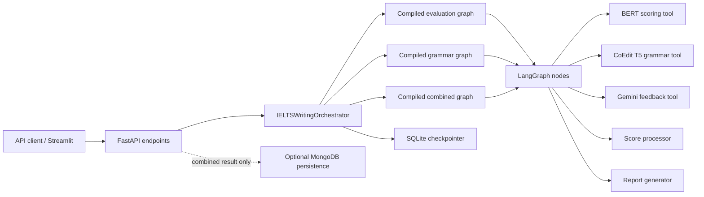
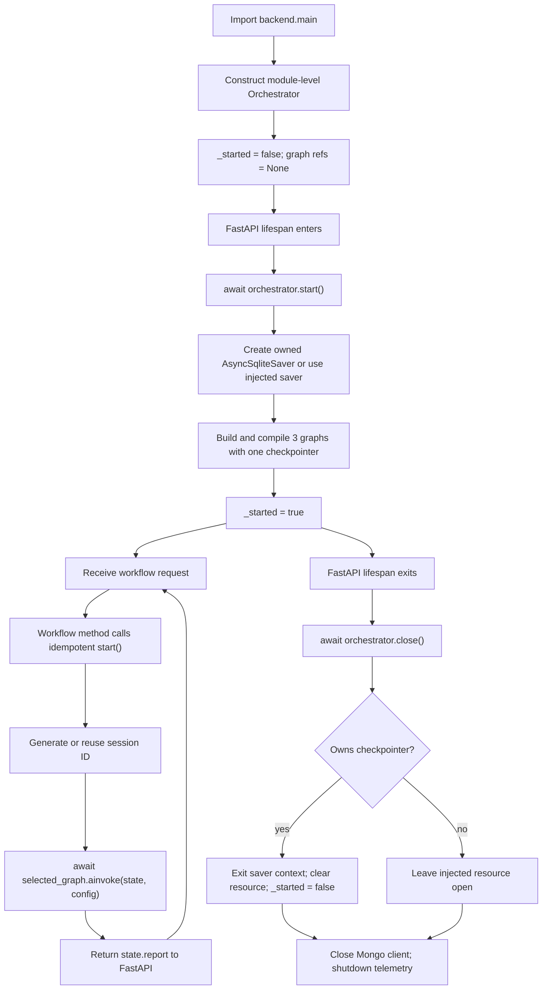
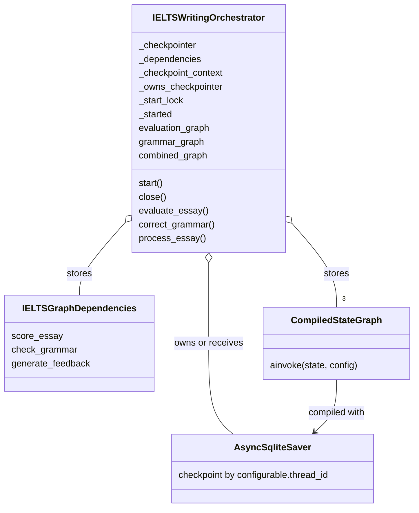

# Học Orchestrator qua IELTS Writing Agent

> Phạm vi nguồn: implementation hiện tại trong repository, `README.md` và
> `AGENTS.md`. Trong tài liệu này, **Code fact** là điều có thể chỉ ra trực tiếp
> từ code hoặc test; **Architecture note** là nhận xét và đề xuất thiết kế.

## 1. Learning objectives

Sau khi học xong, bạn có thể:

1. Giải thích vấn đề mà `IELTSWritingOrchestrator` giải quyết trong dự án.
2. Đặt Orchestrator đúng vị trí giữa FastAPI, LangGraph, các model tool và
  SQLite checkpointer.
3. Theo dõi lifecycle của một Orchestrator từ module import, FastAPI startup,
  xử lý request đến shutdown.
4. Phân biệt `session_id` trong state với `thread_id` trong LangGraph config,
  đồng thời hiểu vì sao chúng đang có cùng giá trị.
5. Mô phỏng chính xác ba use case `evaluate_essay`, `correct_grammar` và
  `process_essay`.
6. Phân biệt vai trò của Orchestrator với vai trò của LangGraph và các tool
  chấm IELTS.
7. Nhận diện điểm tốt, coupling và hướng mở rộng của thiết kế hiện tại mà
  không nhầm nhận xét kiến trúc với behavior đã được code xác nhận.


## 2. Position in the architecture


### 2.1 Orchestrator giải quyết vấn đề gì?

Nếu không có một lớp trung gian, mỗi FastAPI endpoint sẽ phải tự làm nhiều
việc không thuộc giao thức HTTP:

- biết workflow nào phải chạy;
- khởi tạo và giữ SQLite checkpointer;
- compile graph với đúng dependency;
- tạo hoặc nhận `session_id`;
- chuyển ID đó thành LangGraph `thread_id`;
- gọi graph bằng đúng API bất đồng bộ;
- lấy `report` ra khỏi graph state;
- đóng resource checkpoint khi ứng dụng dừng.

**Code fact:** `IELTSWritingOrchestrator` gom các trách nhiệm trên thành ba
public use-case method:

- `evaluate_essay(...)`;
- `correct_grammar(...)`;
- `process_essay(...)`.

FastAPI vì thế chỉ còn làm transport-layer work: nhận và validate request, gọi
use case, rồi trả dict làm JSON response. Ngoại lệ đáng chú ý là
`/essay_process` còn tự điều phối optional MongoDB persistence sau khi
Orchestrator trả kết quả.

### 2.2 Vị trí chính xác

Luồng phụ thuộc runtime là:

```text
API client
  -> FastAPI endpoint
  -> IELTSWritingOrchestrator
  -> một compiled LangGraph
  -> graph nodes
  -> BERT / T5 / Gemini / score processor / report generator

IELTSWritingOrchestrator
  -> sở hữu hoặc nhận checkpointer
  -> truyền cùng checkpointer khi compile cả ba graph
  -> truyền thread_id khi gọi graph
```

Orchestrator nằm ở application boundary: phía trên nó là HTTP/FastAPI; phía
dưới nó là workflow engine và domain/model tools. Nó là facade hướng use case,
không phải engine thực thi DAG và cũng không phải nơi tính band score.

### 2.3 Vì sao dự án cần nó?

**Code fact:** ba endpoint gọi ba method có cùng invocation contract thay vì
tự compile graph hoặc tự tạo checkpoint config. `start()` còn idempotent và có
`asyncio.Lock`, nên lifecycle startup và lazy startup dùng chung một đường code.

**Architecture note:** với ba workflow, Orchestrator tạo một “điểm vào” ổn
định cho application layer. Điều này giảm lặp ở endpoint, cho phép test bằng
dependency/checkpointer giả, và tập trung quyền sở hữu resource. Giá trị chính
không phải vì class này “thông minh”, mà vì nó làm rõ ai chịu trách nhiệm về
workflow lifecycle và invocation contract.

## 3. Relevant files


| File                                 | Class/function quan trọng                                        | Vai trò                                                                                                       |
| ------------------------------------ | ---------------------------------------------------------------- | ------------------------------------------------------------------------------------------------------------- |
| `README.md`                          | `Active architecture`, endpoint và test sections                 | Mô tả pipeline đang hoạt động, checkpoint SQLite và ba API workflow.                                          |
| `AGENTS.md`                          | `Active Architecture`, `Workflows`, `Component Responsibilities` | Đặt ranh giới trách nhiệm mong muốn của FastAPI, Orchestrator, LangGraph và tool.                             |
| `backend/main.py`                    | module scope                                                     | Load environment, tạo telemetry/Mongo objects và tạo một `IELTSWritingOrchestrator`.                          |
| `backend/main.py`                    | `lifespan()`                                                     | Start Orchestrator trước khi phục vụ request; close Orchestrator, Mongo client và telemetry khi shutdown.     |
| `backend/main.py`                    | `evaluate_essay()`                                               | Chuyển request evaluation sang `orchestrator.evaluate_essay()`.                                               |
| `backend/main.py`                    | `grammar_correction()`                                           | Validate query parameter rồi gọi `orchestrator.correct_grammar()`.                                            |
| `backend/main.py`                    | `essay_process()`                                                | Gọi combined workflow, sau đó tùy chọn lưu hai MongoDB document.                                              |
| `backend/agents/orchestrator.py`     | `IELTSWritingOrchestrator`                                       | Sở hữu lifecycle, graph references, session/thread mapping và graph invocation.                               |
| `backend/agents/orchestrator.py`     | `start()`                                                        | Khởi tạo SQLite saver nếu cần và yêu cầu ba graph builder compile graph.                                      |
| `backend/agents/orchestrator.py`     | `close()`                                                        | Đóng checkpointer context nếu Orchestrator là owner.                                                          |
| `backend/agents/ielts_graph.py`      | `IELTSGraphState`                                                | Khai báo shape của state đi qua graph.                                                                        |
| `backend/agents/ielts_graph.py`      | `IELTSGraphDependencies`                                         | Gói ba callable dependency và cho phép test inject mock tool.                                                 |
| `backend/agents/ielts_graph.py`      | ba `build_*_graph()`                                             | Khai báo node/edge và gọi `graph.compile(checkpointer=...)`.                                                  |
| `backend/observability/telemetry.py` | `workflow_span()`, `_start_span()`                               | Tạo workflow span; ghi exception đã sanitize rồi re-raise exception.                                          |
| `backend/tools/report_generator.py`  | ba `build_*_report()`                                            | Tạo object mà Orchestrator trả qua `state["report"]`, bao gồm `session_id` khi có.                            |
| `backend/.env.example`               | `LANGGRAPH_CHECKPOINT_DB`, `LANGGRAPH_STRICT_MSGPACK`            | Cấu hình đường dẫn checkpoint và strict msgpack.                                                              |
| `tests/test_api_contract.py`         | `FakeOrchestrator`, `ApiContractTests`                           | Chứng minh endpoint có thể được test qua một Orchestrator fake và request blank bị 422.                       |
| `tests/test_langgraph_workflow.py`   | `LangGraphWorkflowTests`                                         | Kiểm tra routing ba graph, injected dependencies, checkpoint theo thread và SQLite persistence sau `close()`. |
| `tests/test_telemetry.py`            | `TelemetryTests`                                                 | Kiểm tra workflow/node spans, session privacy và việc exception vẫn truyền ra caller.                         |
| `tests/test_tools_lightweight.py`    | `ReportGeneratorTests`                                           | Kiểm tra shape của evaluation, grammar và combined report.                                                    |


`requirements.txt` khóa `langgraph==1.2.9` và
`langgraph-checkpoint-sqlite==3.1.0`. Tài liệu này không suy rộng behavior sang
phiên bản khác.

## 4. Runtime lifecycle


### 4.1 Module import: tạo object nhưng chưa mở SQLite

Trong `backend/main.py`, module-level statement:

```python
orchestrator = IELTSWritingOrchestrator()
```

gọi `IELTSWritingOrchestrator.__init__()`. Constructor lưu:

- `_checkpointer`: injected object hoặc `None`;
- `_dependencies`: injected `IELTSGraphDependencies` hoặc bộ dependency mặc
định;
- `_checkpoint_path`: argument, environment
`LANGGRAPH_CHECKPOINT_DB`, hoặc `DEFAULT_CHECKPOINT_PATH`;
- `_checkpoint_context`: ban đầu `None`;
- `_owns_checkpointer`: `True` chính xác khi constructor không nhận
checkpointer;
- `_start_lock`: một `asyncio.Lock`;
- `_started`: ban đầu `False`;
- ba graph reference: ban đầu đều `None`.

**Code fact:** constructor chưa gọi `AsyncSqliteSaver` và chưa compile graph.
Object được tạo một lần khi `backend.main` được import, không được tạo lại bên
trong từng endpoint.

Phát biểu chính xác hơn cho deployment là: có một module-level instance trên
mỗi lần module được load trong một Python process. Code hiện tại không cấu hình
multi-worker, nên không nên diễn giải “một instance” thành singleton toàn hệ
thống trên mọi process hoặc máy.

### 4.2 FastAPI startup

`FastAPI(..., lifespan=lifespan)` đăng ký lifecycle context manager.
`lifespan()` gọi:

```python
await orchestrator.start()
```

trước `yield`. Trong `start()`:

1. Nếu `_started` đã `True`, method return ngay.
2. Nếu chưa, method lấy `_start_lock`, rồi kiểm tra `_started` lần thứ hai.
  Đây là double-check để hai coroutine không cùng khởi tạo resource.
3. Nếu `_checkpointer is None`, Orchestrator:
  - đặt mặc định `LANGGRAPH_STRICT_MSGPACK=true` nếu biến chưa tồn tại;
  - import lazy `AsyncSqliteSaver`;
  - tạo parent directory;
  - tạo async context manager bằng `from_conn_string(...)`;
  - gọi `__aenter__()` và lưu saver vào `_checkpointer`.
4. Orchestrator gọi lần lượt ba builder.
5. Mỗi builder tự tạo `StateGraph`, thêm node/edge, rồi gọi
  `graph.compile(checkpointer=checkpointer)`.
6. Ba compiled graph được lưu vào `evaluation_graph`, `grammar_graph`,
  `combined_graph`; `_started` được đặt `True`.

Nếu compile lỗi, `start()` đóng checkpoint context do chính nó sở hữu, xóa
context/checkpointer rồi re-raise. Vì lỗi xảy ra trước `lifespan()` đạt tới
`yield`, startup không hoàn tất.

### 4.3 Request

Mỗi workflow method đều:

1. mở một `workflow_span`;
2. gọi `await self.start()` phòng trường hợp caller sử dụng Orchestrator ngoài
  FastAPI lifespan;
3. dùng `session_id` caller cung cấp, hoặc tạo `str(uuid.uuid4())`;
4. đưa ID vào input state dưới key `session_id`;
5. đưa cùng ID vào `{"configurable": {"thread_id": ID}}`;
6. gọi đúng compiled graph bằng `await graph.ainvoke(...)`;
7. lấy và return `state["report"]`.

**Code fact:** không method nào dùng `invoke`, `stream`, `astream` hoặc
`astream_events`; cả ba đều dùng `ainvoke`.

### 4.4 Shutdown

Khi FastAPI lifespan rời khỏi `yield`, khối `finally` chạy theo thứ tự:

1. `await orchestrator.close()`;
2. `client.close()` nếu Mongo client tồn tại;
3. `shutdown_telemetry()`.

`IELTSWritingOrchestrator.close()` chỉ gọi `__aexit__()` khi Orchestrator sở hữu
checkpointer. Sau đó nó xóa `_checkpoint_context`, `_checkpointer` và đặt
`_started=False`.

Nếu checkpointer được inject, `close()` không đóng resource và không đổi
`_started`; caller đã inject resource là owner của resource đó. Đây là
dependency ownership được thể hiện trực tiếp trong code.

**Architecture note:** `lifespan()` gọi ba cleanup operation tuần tự trong một
`finally`, nhưng không có nested `try/finally`. Nếu `orchestrator.close()` tự
ném lỗi, code hiện tại không bảo đảm hai dòng cleanup sau sẽ chạy. Test hiện
tại không bao phủ trường hợp cleanup thất bại.

## 5. Code walkthrough


### 5.1 Bảng reverse-engineering kết luận chính


| Kết luận                                              | File → class → function/method                                                                                | Vai trò đoạn code                                                                                              |
| ----------------------------------------------------- | ------------------------------------------------------------------------------------------------------------- | -------------------------------------------------------------------------------------------------------------- |
| Orchestrator được khởi tạo ở module scope.            | `backend/main.py` → module scope → `orchestrator = IELTSWritingOrchestrator()`                                | Tạo dependency cấp ứng dụng trước khi tạo `FastAPI app`.                                                       |
| Không tạo lại theo request.                           | `backend/main.py` → ba endpoint                                                                               | Cả ba endpoint tham chiếu cùng global `orchestrator`; không endpoint nào gọi constructor.                      |
| Constructor lưu dependency và lifecycle state.        | `backend/agents/orchestrator.py` → `IELTSWritingOrchestrator.__init__()`                                      | Lưu checkpointer, graph dependencies, path, context, ownership flag, lock, started flag và ba graph reference. |
| SQLite saver được khởi tạo lazy trong `start()`.      | `backend/agents/orchestrator.py` → `IELTSWritingOrchestrator.start()`                                         | Chỉ tạo `AsyncSqliteSaver` khi không có injected checkpointer.                                                 |
| Evaluation graph được compile trong builder.          | `backend/agents/ielts_graph.py` → `build_evaluation_graph()`                                                  | Khai báo linear evaluation DAG rồi `compile(checkpointer=...)`; builder được gọi từ Orchestrator `start()`.    |
| Grammar graph được compile trong builder.             | `backend/agents/ielts_graph.py` → `build_grammar_graph()`                                                     | Khai báo linear grammar DAG rồi compile với cùng checkpointer.                                                 |
| Combined graph được compile trong builder.            | `backend/agents/ielts_graph.py` → `build_combined_graph()`                                                    | Khai báo fan-out/join DAG rồi compile với cùng checkpointer.                                                   |
| FastAPI startup chủ động start Orchestrator.          | `backend/main.py` → `lifespan()`                                                                              | Resource và graph sẵn sàng trước `yield`.                                                                      |
| Public workflow methods vẫn gọi `start()`.            | `backend/agents/orchestrator.py` → cả ba use-case method                                                      | Cho phép lazy, idempotent startup khi dùng class ngoài FastAPI.                                                |
| API hiện tại luôn yêu cầu ID mới.                     | `backend/main.py` → ba workflow endpoint                                                                      | Không endpoint nào nhận hoặc truyền `session_id`.                                                              |
| Orchestrator có khả năng tái sử dụng ID.              | `backend/agents/orchestrator.py` → cả ba use-case method                                                      | Optional `session_id`; dùng lại nếu truthy, nếu không tạo UUID.                                                |
| State ID và checkpoint thread ID là cùng một chuỗi.   | `backend/agents/orchestrator.py` → ba use-case method và `_graph_config()`                                    | `thread_id` local được đưa vào input state và config.                                                          |
| Graph dùng async one-shot invocation.                 | `backend/agents/orchestrator.py` → ba use-case method                                                         | `await <graph>.ainvoke(input, config=...)`.                                                                    |
| Orchestrator chỉ trả report.                          | `backend/agents/orchestrator.py` → ba use-case method                                                         | Full final state không đi qua API; chỉ `state["report"]` được return.                                          |
| Owned checkpointer được đóng khi shutdown.            | `backend/main.py` → `lifespan()`; `backend/agents/orchestrator.py` → `close()`                                | FastAPI gọi close; Orchestrator thoát async context của SQLite saver.                                          |
| Injected checkpointer không bị Orchestrator đóng.     | `backend/agents/orchestrator.py` → `close()`                                                                  | Cleanup có điều kiện theo `_owns_checkpointer`.                                                                |
| Workflow exception không bị Orchestrator chuyển kiểu. | `backend/agents/orchestrator.py` → ba use-case method; `backend/observability/telemetry.py` → `_start_span()` | Không có `except` trong method; span ghi lỗi an toàn rồi bare `raise`.                                         |
| Endpoint không map workflow error sang lỗi nghiệp vụ. | `backend/main.py` → ba workflow endpoint                                                                      | Không có `try/except` quanh Orchestrator call; unhandled error đi lên FastAPI.                                 |
| MongoDB failure là luồng riêng sau combined workflow. | `backend/main.py` → `essay_process()`                                                                         | Chỉ `PyMongoError` bị log và bỏ qua; report vẫn được return.                                                   |


### 5.2 Session ID và thread ID

Ba method đều dùng mẫu:

```python
thread_id = session_id or str(uuid.uuid4())
```

Tên biến local là `thread_id`, nhưng nó đảm nhiệm hai vai trò:

- application/session identity: `"session_id": thread_id` trong graph state và
report;
- checkpoint identity: `configurable.thread_id` trong LangGraph config.

`_graph_config()` chỉ tạo:

```python
{"configurable": {"thread_id": thread_id}}
```

Không có checkpoint namespace, user ID hoặc workflow ID bổ sung trong config.

**Điều code xác nhận:** nếu caller trực tiếp truyền `"abc"` vào method, state
và checkpoint config đều nhận `"abc"`. Test combined liệt kê checkpoint bằng
`thread_id="combined-test"` và tìm thấy record.

**Điều code chưa xác nhận:** không test nào gọi lại cùng workflow hai lần với
cùng ID để chứng minh resume/replay semantics; cũng không test việc dùng cùng
ID cho hai loại workflow khác nhau. Vì vậy chỉ nên kết luận “ID có thể được
truyền lại và dùng làm checkpoint key”, không nên kết luận xa hơn rằng dự án đã
triển khai đầy đủ chức năng resume session.

`prepare_session()` trong combined graph cũng có fallback UUID, nhưng
`process_essay()` luôn truyền một `session_id` truthy do chính Orchestrator đã
tạo hoặc nhận. Trong luồng production hiện tại, node này giữ nguyên ID đã có;
fallback của node chỉ hữu ích nếu graph được gọi theo đường khác mà state thiếu
ID.

### 5.3 Graph dependency injection

`IELTSGraphDependencies` là frozen dataclass chứa ba async callable:

- `score_essay`;
- `check_grammar`;
- `generate_feedback`.

Mặc định, các wrapper import tool bên trong function. BERT sync inference được
đẩy qua `asyncio.to_thread`; grammar và Gemini wrapper được await. Orchestrator
giữ một dependency bundle rồi truyền cùng bundle vào cả ba graph builder.

Test thay bundle này bằng coroutine nhẹ và thay SQLite bằng `InMemorySaver`.
Nhờ vậy graph routing được kiểm tra mà không tải BERT/T5 hay gọi Gemini.

### 5.4 Exception flow

Có bốn tầng cần phân biệt:

1. `EssayEvaluationRequest.must_not_be_blank()` tạo validation error trước khi
  endpoint evaluation/combined chạy; FastAPI trả 422.
2. `grammar_correction()` tự kiểm tra blank query và ném `HTTPException(422)`.
3. `validate_input()` trong graph ném `ValueError` nếu input rỗng. Với API
  hiện tại, phần lớn blank input đã bị HTTP layer chặn; validation node vẫn
   bảo vệ caller gọi Orchestrator trực tiếp.
4. Tool/node/graph error truyền qua `ainvoke` vào Orchestrator. `workflow_span`
  ghi type lỗi đã sanitize vào telemetry và re-raise. Orchestrator không
   chuyển nó thành `HTTPException`, retry hay fallback.

Nếu lỗi workflow không được xử lý tiếp, FastAPI trả unhandled server error.
Khi telemetry instrumentation bật, middleware trong
`backend/observability/telemetry.py` thay exception chưa xử lý ở tầng HTTP bằng
`SanitizedTelemetryError` chỉ chứa qualified exception type. Test xác nhận
HTTP 500 và không để provider/user message lọt vào span.

Riêng lỗi MongoDB xảy ra sau `process_essay()` và không đi qua Orchestrator.
`essay_process()` bắt `PyMongoError`, log rồi vẫn trả result. Đây không phải
exception policy chung cho workflow.

## 6. Core concepts


### 6.1 Orchestrator pattern

Orchestrator pattern dùng một component trung tâm để chọn, chuẩn bị và điều
phối các bước hoặc workflow của một use case. Nó định nghĩa “cái gì được gọi,
với context nào, resource nào và lifecycle nào”, còn công việc chuyên môn được
ủy quyền.

Trong dự án:

- Orchestrator chọn một trong ba compiled graph.
- Nó chuẩn hóa session/thread config.
- Nó quản lý checkpointer và graph lifecycle.
- Nó không tự thực hiện node sequence; LangGraph làm việc đó.
- Nó không tính band score; dependency/tool làm việc đó.


### 6.2 Application service

Application service là API hướng use case cho tầng bên ngoài. Nó phối hợp
domain/infrastructure component nhưng thường không chứa thuật toán nghiệp vụ
cốt lõi.

Ba method của `IELTSWritingOrchestrator` chính là ba application operation mà
FastAPI cần. Input của chúng là dữ liệu use case (`question`, `answer`,
optional `session_id`), output là report dict. Endpoint không cần biết node
name, edge hay checkpointer API.

Orchestrator này có thể gọi là application service kiêm workflow facade. Đây
là nhận xét kiến trúc; code không dùng framework hay base class để chính thức
gắn nhãn nó.

### 6.3 Lifecycle management

Lifecycle management trả lời:

- resource được tạo lúc nào;
- ai được dùng nó;
- có thể start nhiều lần an toàn không;
- resource được đóng lúc nào;
- startup failure cleanup ra sao.

Code hiện tại trả lời bằng `__init__()`, `start()`, `_start_lock`, `_started`,
`close()` và FastAPI `lifespan()`. Điểm tinh tế là constructor chỉ cấu hình
object; resource I/O và graph compilation nằm trong async `start()`.

### 6.4 Dependency ownership

Dependency ownership là quyền và nghĩa vụ quản lý tuổi thọ của dependency.

- Không inject checkpointer: Orchestrator tạo saver, `_owns_checkpointer=True`
và phải đóng saver.
- Có inject checkpointer: Orchestrator chỉ sử dụng nó,
`_owns_checkpointer=False` và không đóng nó.

Quy tắc này ngăn một service tự ý đóng resource mà test harness hoặc caller
khác sở hữu. Graph dependencies cũng được inject, nhưng chúng là callable
bundle không có lifecycle/cleanup trong code hiện tại.

### 6.5 Separation of concerns

Ranh giới hiện tại:

- FastAPI: transport validation, HTTP response, health endpoints và optional
Mongo persistence của combined endpoint.
- Orchestrator: application workflow selection, invocation context và
lifecycle.
- LangGraph definition: state, node, edge, fan-out/join.
- Tool: BERT/T5/Gemini/model logic.
- Score/report functions: transform và format output.
- Telemetry: span và privacy policy.

Không phải ranh giới nào cũng hoàn hảo, nhưng scoring logic đã không bị đặt
trong Orchestrator. Điều này phù hợp với `AGENTS.md`.

### 6.6 Vì sao FastAPI không nên trực tiếp quản lý toàn bộ LangGraph?

Nếu mỗi endpoint tự làm việc của Orchestrator, HTTP layer sẽ coupling với:

- `AsyncSqliteSaver`;
- checkpoint path và context manager;
- graph builder/compile API;
- session/thread convention;
- graph output key `"report"`;
- shutdown cleanup.

Khi đó test endpoint phải dựng nhiều infrastructure hơn, lifecycle dễ bị lặp
hoặc đóng sai, và thay checkpoint backend đòi sửa nhiều endpoint. Code hiện
tại chứng minh một lựa chọn tốt hơn: `test_api_contract.py` thay global
Orchestrator bằng `FakeOrchestrator` và test API mà không dựng LangGraph.

### 6.7 Vì sao Orchestrator không nên chứa logic chấm IELTS?

Band prediction, grammar correction và feedback có tốc độ, dependency và failure
mode khác nhau. Đặt thuật toán đó vào Orchestrator sẽ:

- làm application service phụ thuộc trực tiếp model/provider;
- cản việc mock từng tool;
- trộn lifecycle workflow với nghiệp vụ scoring;
- làm graph node chỉ còn là wrapper vô nghĩa;
- khó thay model độc lập.

Code hiện tại đặt callable trong `IELTSGraphDependencies` và gọi chúng từ node.
Orchestrator chỉ giữ bundle và truyền vào lúc build graph.

### 6.8 Orchestrator khác LangGraph


| Orchestrator                            | LangGraph trong dự án                               |
| --------------------------------------- | --------------------------------------------------- |
| Chọn graph theo use case.               | Mô tả và thực thi node/edge bên trong một workflow. |
| Sở hữu/nhận checkpointer.               | Nhận checkpointer khi `compile()`.                  |
| Tạo/reuse session ID và graph config.   | Dùng state và config khi `ainvoke()`.               |
| Có application lifecycle `start/close`. | Compiled graph là runtime được Orchestrator giữ.    |
| Return `state["report"]`.               | Tạo full final state qua các node.                  |


Nói ngắn gọn: Orchestrator quản lý **workflow như một application capability**;
LangGraph quản lý **cách workflow chạy như một graph**.

### 6.9 Orchestrator khác utility function và service thông thường

Một utility function thường stateless, không sở hữu resource và không có
startup/shutdown. Class hiện tại giữ checkpointer, compiled graph, lock và
started state, nên không phải utility.

“Service thông thường” là khái niệm rộng; Orchestrator thực ra là một loại
service. Điểm làm nó có tính orchestrator là nó phối hợp nhiều workflow/runtime
component và context thay vì chỉ cung cấp một phép biến đổi đơn lẻ. Không có
ranh giới kỹ thuật tuyệt đối: tên gọi đến từ trách nhiệm và topology phối hợp.

## 7. Request walkthroughs


### 7.1 `POST /evaluate_essay`

1. FastAPI parse JSON vào object `EssayEvaluationRequest`.
2. `EssayEvaluationRequest.must_not_be_blank()` strip `question` và `answer`;
  blank field tạo 422, endpoint chưa chạy.
3. `backend.main.evaluate_essay()` chạy với object request đã validate.
4. Endpoint dùng module-level object `orchestrator` và gọi
  `await orchestrator.evaluate_essay(question, answer)`. Không truyền
   `session_id`.
5. `IELTSWritingOrchestrator.evaluate_essay()` mở workflow span tên
  `ielts.workflow.evaluate`; session source là `"generated"`.
6. `await self.start()` return nhanh trong runtime FastAPI bình thường vì
  lifespan đã start object. Nếu dùng ngoài lifespan, nó sẽ khởi tạo resource.
7. Method tạo UUID string và đặt vào local `thread_id`.
8. Input state là `question`, `answer`, `session_id=thread_id`.
9. Config là `{"configurable": {"thread_id": thread_id}}`.
10. `evaluation_graph.ainvoke(...)` chạy:
  `validate_input → score_essay → generate_feedback → process_scores →   build_report`.
11. `build_evaluation_report_node()` đưa session ID vào report.
12. Orchestrator trả `state["report"]`.
13. Endpoint return trực tiếp dict; FastAPI serialize thành JSON.

Không có MongoDB persistence trong endpoint này.

### 7.2 `POST /grammar_correction`

1. `answer` là FastAPI function parameter đơn giản nên endpoint hiện nhận nó
  dưới dạng query parameter, không dùng `EssayEvaluationRequest`.
2. FastAPI yêu cầu parameter tồn tại; function còn gọi `answer.strip()` và ném
  `HTTPException(422)` nếu blank.
3. `backend.main.grammar_correction()` gọi module-level object
  `orchestrator.correct_grammar(answer)` mà không truyền session ID.
4. `IELTSWritingOrchestrator.correct_grammar()` mở
  `ielts.workflow.grammar`, gọi idempotent `start()`, rồi tạo UUID.
5. Input state chỉ gồm `answer` và `session_id`; không có `question`.
6. Cùng UUID được đặt tại `configurable.thread_id`.
7. `grammar_graph.ainvoke(...)` chạy:
  `validate_input → correct_grammar → build_report`.
8. `validate_input()` chấp nhận `question is None`; grammar dependency trả
  `grammar_result`.
9. `build_grammar_report_node()` tạo report và đưa session ID vào report.
10. Orchestrator trả `state["report"]`; endpoint return trực tiếp cho FastAPI.


### 7.3 `POST /essay_process`

1. FastAPI parse/strip JSON bằng `EssayEvaluationRequest`.
2. `backend.main.essay_process()` lấy timestamp UTC trước khi gọi workflow.
3. Endpoint gọi module-level `orchestrator.process_essay(question, answer)`;
  không truyền session ID.
4. `IELTSWritingOrchestrator.process_essay()` mở
  `ielts.workflow.combined`, gọi `start()`, tạo UUID.
5. Input state và `configurable.thread_id` nhận cùng UUID.
6. `combined_graph.ainvoke(...)` bắt đầu:
  - `validate_input` strip và kiểm tra dữ liệu;
  - `prepare_session` nhận thấy `session_id` đã có và giữ nguyên;
  - graph fan-out sang `score_essay` và `correct_grammar`;
  - sau `score_essay`, nhánh evaluation chạy `generate_feedback`, rồi
  `process_scores`;
  - `build_report` có incoming join từ `process_scores` và
  `correct_grammar`, nên report cần kết quả của cả hai nhánh.
7. `build_combined_report_node()` tạo một report chứa session, feedback,
  scores và ba grammar field.
8. Orchestrator return `state["report"]` cho endpoint.
9. Nếu `db is None`, endpoint bỏ qua persistence và return result.
10. Nếu Mongo được cấu hình, endpoint dùng `asyncio.gather()` và
  `asyncio.to_thread()` để insert evaluation và grammar document.
11. Nếu insert ném `PyMongoError`, endpoint log lỗi rồi vẫn return report.
12. FastAPI serialize result thành JSON.

Test mock xác nhận hai tool `score` và `grammar` là hai lời gọi đầu tiên, không
ép thứ tự giữa chúng; `feedback` đến sau. Test cũng xác nhận combined report
dùng ID đã cung cấp và checkpointer có record dưới cùng `thread_id`.

## 8. Design analysis

Phần này là **Architecture note**, trừ khi một ý được ghi rõ là test/code fact.

### 8.1 Điểm thiết kế tốt

- Application boundary rõ: endpoint gọi method theo use case, không biết node
và edge.
- Một instance giữ graph đã compile, thay vì compile lại trên mỗi request.
- `start()` idempotent và có lock, hỗ trợ cả eager startup từ FastAPI lẫn lazy
startup từ caller trực tiếp.
- Ownership checkpointer rõ ràng giữa created và injected dependency.
- Một session convention thống nhất cho state/report/checkpoint.
- Async graph invocation phù hợp với async FastAPI endpoint.
- Dependency injection cho model tool và checkpointer làm workflow test nhẹ,
deterministic và không cần external service.
- Compile failure cleanup saver do Orchestrator sở hữu.
- Orchestrator trả report public thay vì làm lộ toàn bộ internal graph state.
- Telemetry bao quanh use case nhưng không thêm raw session/essay vào span.


### 8.2 Coupling đang tồn tại

- Orchestrator import trực tiếp ba concrete graph builder.
- Orchestrator biết ba attribute cụ thể
`evaluation_graph/grammar_graph/combined_graph`.
- Cả ba method giả định final state luôn có key `"report"`.
- Session identity và checkpoint thread identity bị gộp thành một string.
- Orchestrator trực tiếp biết `AsyncSqliteSaver`, environment variable và
filesystem path.
- Ba public method lặp cùng template span → start → ID → state → config →
`ainvoke` → report.
- `backend.main` giữ dependency dưới dạng mutable module global; test thay nó
trực tiếp.
- Cả ba graph dùng chung checkpointer nhưng config không thêm workflow-specific
namespace trong code này.

Coupling không đồng nghĩa với bug. Với ba workflow, phần lớn coupling trên còn
nhỏ, dễ đọc và có thể là lựa chọn thực dụng.

### 8.3 Trách nhiệm có nguy cơ đặt sai lớp

- Optional Mongo persistence của `/essay_process` làm endpoint biết shape chi
tiết của combined report và schema hai collection. Khi persistence lớn hơn,
đây có thể nên là repository/application operation riêng.
- Checkpoint backend construction nằm cùng workflow facade. Nếu có nhiều
backend hoặc deployment mode, nên tách factory/configuration khỏi
orchestration.
- Telemetry span nằm trong Orchestrator là hợp lý cho use-case tracing, nhưng
direct import làm application service coupling với observability
implementation.
- `_checkpoint_backend()` suy ra label `"sqlite"` chỉ từ ownership. Code fact:
một custom checkpointer được inject luôn được label `"injected"`, không mô tả
backend thật.

Orchestrator hiện không chứa logic chấm IELTS; đó là ranh giới nên giữ.

### 8.4 Nếu thêm 10 workflow mới

Thiết kế hiện tại vẫn chạy được về mặt khái niệm, nhưng sẽ tăng tuyến tính:

- thêm import builder;
- thêm graph attribute;
- thêm đoạn compile trong `start()`;
- thêm public method với invocation boilerplate;
- có thể thêm endpoint mapping.

Ở quy mô đó, một registry có thể phù hợp:

```text
workflow name
  -> graph builder
  -> input-state adapter
  -> report selector
```

Một private `_run_workflow(name, state, session_id)` có thể gom invocation
contract; public typed method vẫn nên được giữ để API rõ và tránh endpoint
truyền tùy ý tên workflow. Không nên chuyển scoring/node logic vào registry.

### 8.5 Nếu bỏ Orchestrator và gọi graph trực tiếp từ endpoint

Hậu quả dự kiến:

- endpoint phải sở hữu hoặc truy cập checkpointer;
- startup/shutdown bị đưa vào transport layer hoặc module globals rời rạc;
- session/thread mapping lặp ba nơi;
- endpoint coupling với graph output state;
- khó test API độc lập như `FakeOrchestrator`;
- thay checkpoint backend hoặc invocation policy phải sửa nhiều endpoint;
- nguy cơ compile graph theo request hoặc bỏ quên cleanup tăng.

Gọi trực tiếp không phải lúc nào cũng sai cho prototype một workflow, nhưng sẽ
làm mất ranh giới application service mà code hiện tại đã thiết lập.

### 8.6 Phần nên giữ nguyên

- Public methods theo use case.
- Async `start/close` tích hợp FastAPI lifespan.
- Ownership rule cho injected checkpointer.
- Dependency injection cho tool callable.
- Graph topology và IELTS logic ở ngoài Orchestrator.
- Cùng ID đi vào report và checkpoint, nếu đây vẫn là product-level session
semantics mong muốn.
- `ainvoke` cho request/response one-shot hiện tại.


### 8.7 Phần có thể refactor trong tương lai

- Tách checkpoint factory/path resolution khỏi Orchestrator.
- Gom invocation boilerplate vào một private helper.
- Dùng graph registry khi số workflow thực sự tăng.
- Dùng FastAPI dependency/app state thay mutable module global nếu cần test,
multi-app hoặc deployment composition rõ hơn.
- Tách Mongo persistence thành repository/service được inject.
- Làm `/ready` kiểm tra state/resource thật; hiện response `"checkpointed"` là
literal và không đọc `_started` hay ping saver.
- Bọc cleanup thành các `try/finally` lồng nhau nếu cần đảm bảo mọi resource
đều được đóng khi một cleanup thất bại.
- Quyết định rõ session ID public có nên đồng nhất với checkpoint thread ID,
và có cần workflow namespace hay không.
- Thêm test cho start concurrency, start failure, close failure, generated ID,  
ID reuse và cùng ID qua nhiều workflow.

## 9. Mermaid diagrams


### 9.1 Kiến trúc FastAPI → Orchestrator → LangGraph




### 9.2 Lifecycle startup → request → shutdown




### 9.3 Sequence diagram của `POST /essay_process`

```mermaid
sequenceDiagram
    actor C as Client
    participant F as FastAPI essay_process
    participant O as IELTSWritingOrchestrator
    participant G as Combined compiled graph
    participant S as Score branch
    participant R as Grammar branch
    participant M as Optional MongoDB

    C->>F: POST question + answer
    F->>F: Pydantic validate and strip
    F->>O: await process_essay(question, answer)
    O->>O: open workflow span; await start()
    O->>O: generate UUID
    O->>G: ainvoke(state with session_id, config with thread_id)
    G->>G: validate_input → prepare_session

    par Evaluation branch
        G->>S: score_essay
        S-->>G: overall_score
        G->>S: generate_feedback → process_scores
        S-->>G: feedback + criteria scores
    and Grammar branch
        G->>R: correct_grammar
        R-->>G: grammar_result
    end

    G->>G: join at build_report
    G-->>O: final state
    O-->>F: state["report"]

    opt MongoDB configured
        par evaluation insert
            F->>M: insert evaluation document via to_thread
        and grammar insert
            F->>M: insert grammar document via to_thread
        end
        Note over F,M: PyMongoError is logged and swallowed
    end

    F-->>C: JSON report
```


### 9.4 Quan hệ Orchestrator, graph và checkpointer




## 10. Common misunderstandings

1. **“Orchestrator chính là LangGraph.”** Không. Orchestrator giữ và chọn
  compiled graph; LangGraph định nghĩa/thực thi node topology.
2. **“Constructor mở SQLite ngay.”** Không. Constructor chỉ lưu cấu hình;
  `start()` mới vào `AsyncSqliteSaver` context.
3. **“Mỗi request tạo một Orchestrator.”** Không trong code hiện tại. Endpoint
  dùng module-level instance; mỗi request chỉ tạo session UUID mới.
4. **“Mọi request có thể gửi lại session ID.”** Không qua API schema hiện tại.
  Chỉ public Python method nhận optional `session_id`.
5. **“**`session_id` **và** `thread_id` **là hai giá trị khác nhau.”** Hiện tại chúng
  là hai vai trò của cùng một chuỗi.
6. **“Combined graph tự tạo ID ở** `prepare_session`**.”** Trong production path,
  Orchestrator đã luôn đặt ID trước khi graph chạy; node chỉ giữ lại ID đó.
7. **“Graph được stream để frontend thấy tiến độ.”** Không. Cả ba method dùng
  `ainvoke` và chỉ return khi workflow kết thúc hoặc lỗi.
8. **“Orchestrator xử lý lỗi model thành HTTP response.”** Không. Nó ghi
  telemetry an toàn rồi exception tiếp tục truyền lên.
9. **“**`close()` **luôn đóng checkpointer.”** Chỉ khi Orchestrator tạo và sở hữu
  checkpointer. Injected resource thuộc caller.
10. **“MongoDB thuộc Orchestrator lifecycle.”** Mongo client được tạo/đóng ở
  `backend.main`; combined persistence diễn ra trong endpoint.
11. **“Checkpoint test chứng minh resume hoàn chỉnh.”** Test chỉ chứng minh có
  record đúng thread và SQLite data tồn tại sau close.
12. **“**`/ready` **đang ping SQLite.”** Không. Nó trả literal
  `"langgraph": "checkpointed"`.

## 11. Keywords for further study

- Orchestrator pattern
- application service
- facade pattern
- dependency injection
- dependency ownership
- resource lifecycle
- FastAPI lifespan
- async context manager
- idempotent initialization
- double-checked locking
- LangGraph `StateGraph`
- graph compilation
- checkpoint saver
- `configurable.thread_id`
- workflow state
- fan-out and join
- structured concurrency
- application boundary
- separation of concerns
- repository pattern
- exception propagation
- observability boundary
- graceful shutdown
- workflow registry
- session identity versus persistence identity

