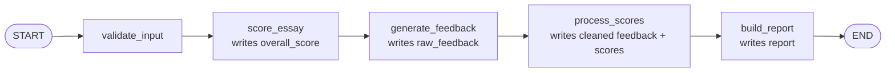
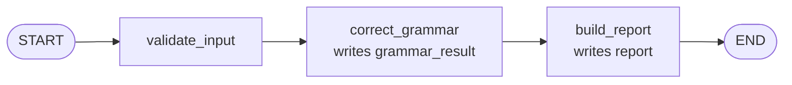
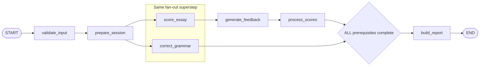
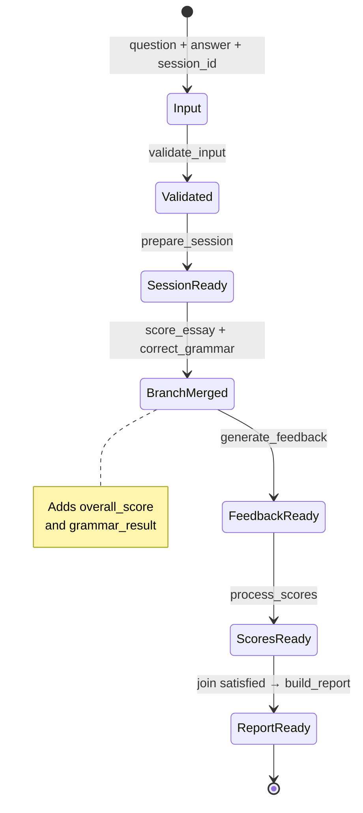
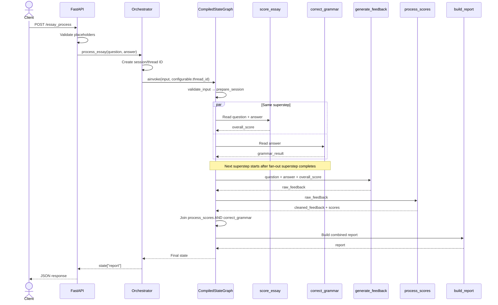

# Học LangGraph qua IELTS Writing Agent

> Phạm vi nguồn: implementation hiện tại của repository, test mock hiện có và
> source/runtime LangGraph `1.2.9` đang được khóa trong `requirements.txt`.
>
> Quy ước:
>
> - **Project code fact**: đọc trực tiếp được từ code hoặc test của dự án.
> - **Observed runtime fact**: quan sát bằng mock tool và `InMemorySaver`, không
> tải model và không gọi Gemini.
> - **Design note**: phân tích kiến trúc, không phải behavior được code bảo đảm.
>
> Tất cả ví dụ state chỉ dùng placeholder. Tên field thật trong code là
> `answer`, không phải `essay`.

## 1. Learning objectives

Sau tài liệu này, bạn có thể:

1. Giải thích vai trò riêng của LangGraph trong IELTS Writing Agent.
2. Đọc `IELTSGraphState` và truy vết mỗi field từ input đến report.
3. Phân biệt node function, node name và node factory.
4. Đọc `START`, `END`, edge đơn, fan-out edge và multi-start join edge.
5. Mô phỏng ba workflow evaluation, grammar và combined.
6. Hiểu superstep ảnh hưởng thế nào đến concurrency trong combined graph.
7. Giải thích graph được build, compile và tái sử dụng ra sao.
8. Giải thích quan hệ giữa `session_id`, `configurable.thread_id` và SQLite
  checkpoint.
9. Phân biệt checkpoint nội bộ của LangGraph với final-result persistence trong
  MongoDB.
10. Dùng dependency injection để test routing mà không chạy BERT, T5 hay Gemini.
11. Phân tích state/checkpoint khi một node raise exception mà không tuyên bố
  dự án đã có tính năng resume.


## 2. LangGraph’s role in this project

LangGraph là workflow execution engine của dự án. Nó đảm nhiệm:

- biểu diễn shared workflow state;
- đăng ký node;
- định nghĩa dependency bằng edge;
- schedule node theo graph;
- merge partial state updates;
- tạo fan-out và fan-in;
- chạy graph bất đồng bộ;
- phối hợp checkpoint với `thread_id`.

LangGraph **không** đảm nhiệm:

- parse hoặc validate HTTP request của FastAPI;
- chọn workflow theo endpoint;
- tạo production SQLite connection;
- tính IELTS score;
- gọi model trực tiếp từ Orchestrator;
- lưu final result vào MongoDB;
- chuyển mọi exception thành HTTP error có cấu trúc.

Ranh giới runtime:

```text
FastAPI
  -> IELTSWritingOrchestrator
      -> CompiledStateGraph.ainvoke(...)
          -> LangGraph scheduler
              -> project node functions
                  -> BERT / T5 / Gemini / processors
          -> checkpointer
```

`backend/agents/ielts_graph.py` là nơi dự án mô tả graph.  
`backend/agents/orchestrator.py` là nơi graph được chọn, giữ và gọi.  
`backend/main.py` là HTTP boundary.

### Sự khác biệt giữa tài liệu mô tả và behavior thực tế

`README.md` và `AGENTS.md` nói BERT và T5 bắt đầu song song; điều này đúng với
builder và runtime: hai node được schedule trong cùng superstep.

Tài liệu cũng có thể tạo cảm giác Gemini bắt đầu ngay khi BERT xong. Edge
`score_essay → generate_feedback` đúng là dependency trực tiếp. Tuy nhiên,
LangGraph chạy theo superstep: `score_essay` và `correct_grammar` thuộc cùng
fan-out superstep, và superstep kế tiếp chưa bắt đầu cho tới khi các task hiện
tại kết thúc. Probe mock trên phiên bản đang cài quan sát:

```text
grammar:start
score:start
score:end
grammar:end
feedback:start
```

Vì vậy, T5 chậm vẫn có thể trì hoãn thời điểm Gemini bắt đầu. Đây là nuance của
runtime, không thể nhìn thấy nếu chỉ đọc sơ đồ README.

`AGENTS.md` nói mỗi workflow nhận unique `session_id`. Với ba endpoint hiện
tại, điều này đúng vì endpoint không nhận ID từ client và Orchestrator tạo UUID.
Nhưng Python API của Orchestrator còn cho caller truyền lại `session_id`; do đó
“luôn unique” không phải invariant được class cưỡng chế.

## 3. Relevant files


| File                                  | Class/function                     | Vai trò LangGraph                                              |
| ------------------------------------- | ---------------------------------- | -------------------------------------------------------------- |
| `backend/agents/ielts_graph.py`       | `IELTSGraphState`                  | Khai báo chín state field.                                     |
| `backend/agents/ielts_graph.py`       | `IELTSGraphDependencies`           | Gói ba external tool callable có thể inject.                   |
| `backend/agents/ielts_graph.py`       | `validate_input()`                 | Normalize và validate shared input.                            |
| `backend/agents/ielts_graph.py`       | `prepare_session()`                | Đảm bảo combined state có `session_id`.                        |
| `backend/agents/ielts_graph.py`       | ba node factory `_..._node()`      | Capture dependency và trả async node function.                 |
| `backend/agents/ielts_graph.py`       | `process_scores_node()`            | Chuyển raw Gemini feedback thành public feedback và score.     |
| `backend/agents/ielts_graph.py`       | ba `build_*_report_node()`         | Tạo report theo từng workflow.                                 |
| `backend/agents/ielts_graph.py`       | ba `build_*_graph()`               | Tạo `StateGraph`, add node/edge và compile.                    |
| `backend/agents/orchestrator.py`      | `IELTSWritingOrchestrator.start()` | Tạo saver, gọi graph builders và giữ compiled graphs.          |
| `backend/agents/orchestrator.py`      | ba workflow method                 | Tạo state/config rồi gọi `ainvoke`.                            |
| `backend/main.py`                     | ba POST endpoint                   | Chọn Orchestrator use case từ HTTP route.                      |
| `backend/tools/bert_scoring.py`       | `score_essay()`                    | Sync interface: `(question, answer) -> float`.                 |
| `backend/tools/grammar_checker.py`    | `check_grammar()`                  | Async interface: `answer -> grammar dict`.                     |
| `backend/tools/feedback_generator.py` | `generate_feedback()`              | Async interface: `(question, answer, score) -> feedback dict`. |
| `backend/tools/score_processor.py`    | extraction/cleaning functions      | Pure synchronous processing được node gọi trực tiếp.           |
| `backend/tools/report_generator.py`   | ba report functions                | Pure synchronous formatting được report node gọi trực tiếp.    |
| `backend/observability/telemetry.py`  | `node_span()`, `_start_span()`     | Tạo span cho node, ghi lỗi đã sanitize rồi re-raise.           |
| `tests/test_langgraph_workflow.py`    | `LangGraphWorkflowTests`           | Test routing, injected tools, in-memory và SQLite checkpoint.  |
| `tests/test_telemetry.py`             | `TelemetryTests`                   | Test node spans và exception propagation.                      |
| `tests/test_tools_lightweight.py`     | processor/report tests             | Test pure logic được node sử dụng.                             |
| `requirements.txt`                    | LangGraph pins                     | `langgraph==1.2.9`, `langgraph-checkpoint-sqlite==3.1.0`.      |


Không cần đọc sâu model implementation để hiểu graph. Graph chỉ cần biết
interface và output shape của tool.

## 4. State schema


### 4.1 State dùng kiểu gì?

State được định nghĩa tại
`backend/agents/ielts_graph.py → IELTSGraphState`:

```python
class IELTSGraphState(TypedDict, total=False):
    question: str
    answer: str
    session_id: str
    overall_score: float
    raw_feedback: dict
    cleaned_feedback: dict
    overall_criteria_scores: dict
    grammar_result: dict
    report: dict
```

Đây là `TypedDict`, không phải:

- Pydantic model;
- dataclass;
- mutable domain object;
- ORM document.

`total=False` làm cả chín key optional ở mức static typing. Nó phù hợp với state
được điền dần, nhưng không có nghĩa mọi node chấp nhận mọi partial state.
Nhiều node dùng `state["key"]`, nên các key đó là runtime precondition.

`TypedDict` không validate runtime value. Một ví dụ thật trong code:
`question` được annotate là `str`, nhưng grammar workflow không có question và
`validate_input()` trả `"question": None`. LangGraph chấp nhận giá trị đó vì
không có Pydantic runtime validation.

### 4.2 Bảng toàn bộ field


| Field                     | Type khai báo | Khởi tạo/ghi đầu tiên                                          | Node đọc                                                                | Node ghi                           | Bắt buộc hay tùy chọn                                                                     | Workflow                                                      | Checkpoint                                | Serialization/privacy                                                                                                               |
| ------------------------- | ------------- | -------------------------------------------------------------- | ----------------------------------------------------------------------- | ---------------------------------- | ----------------------------------------------------------------------------------------- | ------------------------------------------------------------- | ----------------------------------------- | ----------------------------------------------------------------------------------------------------------------------------------- |
| `question`                | `str`         | Orchestrator input cho evaluation/combined                     | `validate_input`, `score_essay`, `generate_feedback`                    | `validate_input` ghi bản `strip()` | Schema optional; operationally required cho evaluation/combined; absent ban đầu ở grammar | Evaluation, Combined; grammar có thể nhận `None` sau validate | Có, khi present; là tracked state channel | String dễ serialize nhưng chứa đề người dùng; cần coi là dữ liệu nhạy cảm. Grammar có type mismatch `None`.                         |
| `answer`                  | `str`         | Orchestrator input cho cả ba workflow                          | `validate_input`, `score_essay`, `correct_grammar`, `generate_feedback` | `validate_input` ghi bản `strip()` | Schema optional; operationally required cho mọi workflow                                  | Cả ba                                                         | Có                                        | Dễ serialize nhưng là essay đầy đủ; privacy risk cao và tăng kích thước checkpoint.                                                 |
| `session_id`              | `str`         | Orchestrator luôn đưa vào input; `prepare_session` có fallback | `prepare_session`; ba report node đọc trực tiếp hoặc bằng `get`         | `prepare_session` trong combined   | Schema optional; Orchestrator path luôn cung cấp; combined report dùng bắt buộc           | Cả ba                                                         | Có                                        | Dễ serialize; là identifier. Telemetry không ghi raw ID nhưng checkpoint có.                                                        |
| `overall_score`           | `float`       | `score_essay`                                                  | `generate_feedback`                                                     | `score_essay`                      | Chỉ tồn tại sau score; bắt buộc trước feedback                                            | Evaluation, Combined                                          | Có                                        | Float đơn giản; là dữ liệu đánh giá người dùng. `float(...)` có thể lỗi nếu tool trả không hợp lệ.                                  |
| `raw_feedback`            | `dict`        | `generate_feedback`                                            | `process_scores`                                                        | `generate_feedback`                | Bắt buộc trước score processing                                                           | Evaluation, Combined                                          | Có                                        | Untyped dict có rủi ro chứa object không hỗ trợ msgpack; output hiện tại kỳ vọng JSON-like. Chứa feedback nhạy cảm và có thể lớn.   |
| `cleaned_feedback`        | `dict`        | `process_scores`                                               | evaluation/combined `build_report`                                      | `process_scores`                   | Bắt buộc trước evaluation/combined report                                                 | Evaluation, Combined                                          | Có                                        | JSON-like dict; chứa nội dung phản hồi. Duplicates phần lớn `raw_feedback`.                                                         |
| `overall_criteria_scores` | `dict`        | `process_scores`                                               | evaluation/combined `build_report`                                      | `process_scores`                   | Bắt buộc trước evaluation/combined report                                                 | Evaluation, Combined                                          | Có                                        | JSON-like, nhỏ; vẫn là dữ liệu đánh giá cá nhân.                                                                                    |
| `grammar_result`          | `dict`        | `correct_grammar`                                              | grammar/combined `build_report`                                         | `correct_grammar`                  | Bắt buộc trước grammar/combined report                                                    | Grammar, Combined                                             | Có                                        | Chứa corrected text và HTML, thường tái hiện essay; privacy và checkpoint-size risk cao. Shape chưa được state type mô tả chi tiết. |
| `report`                  | `dict`        | một trong ba `build_report` node                               | Orchestrator đọc final state                                            | workflow-specific `build_report`   | Chỉ bắt buộc ở graph output contract                                                      | Cả ba                                                         | Có trong final checkpoint                 | Lặp lại feedback/score/grammar data đã có trong state; tăng storage. Untyped dict nhưng hiện JSON-like.                             |


Không state field nào được đánh dấu `UntrackedValue`; vì vậy tất cả là candidate
cho checkpoint khi chúng tồn tại. Checkpoint còn có internal channel,
metadata, version và pending writes của LangGraph, không chỉ chín business key.

### 4.3 Node mutate hay trả partial update?

Mọi project node đều return một dict mới:

```text
State -> Partial<State>
```

Không node nào viết:

```python
state["field"] = ...
```

Ví dụ:

```python
return {"overall_score": float(overall_score)}
```

Điều này giúp node đọc một snapshot và mô tả output riêng. `process_scores_node`
còn dùng processor tạo deep copy cho cleaned feedback; nó không xóa score khỏi
`raw_feedback`.

### 4.4 LangGraph merge partial updates thế nào?

`IELTSGraphState` không dùng `Annotated[..., reducer]`. Trong LangGraph 1.2.9,
schema field không có reducer trở thành `LastValue` channel:

- zero update trong một superstep: giữ giá trị cũ;
- một update: thay bằng giá trị mới;
- nhiều update cho cùng key trong cùng superstep: `InvalidUpdateError`.

Update được áp dụng ở ranh giới superstep. Hai node trong cùng fan-out đọc cùng
state snapshot; node này không thấy partial update của node kia giữa
superstep.

### 4.5 Field nào được nhiều node ghi?

Xét toàn bộ codebase:

- `question`: input và `validate_input`;
- `answer`: input và `validate_input`;
- `session_id`: input và `prepare_session`;
- `report`: ba report function khác nhau, nhưng mỗi compiled graph chỉ đăng ký
đúng một trong số chúng;
- các field khác có đúng một project node writer.

Không có hai parallel node hiện tại cùng ghi một business key:

```text
score_essay      -> overall_score
correct_grammar  -> grammar_result
```

Do đó current fan-out không tạo concurrent update conflict.

Nếu thêm hai parallel node cùng return `{"raw_feedback": ...}` mà không thêm
reducer hoặc thiết kế key riêng, LangGraph sẽ reject thay vì chọn ngẫu nhiên
một giá trị. Đây là conflict detection, không phải last-writer-wins giữa hai
writer trong cùng superstep.

### 4.6 Race condition hiện tại

Ở state layer, nguy cơ race thấp vì:

- node return partial update;
- hai parallel branch ghi key khác nhau;
- merge xảy ra tại superstep boundary;
- không có shared mutable state object bị node sửa trực tiếp.

Điều đó không tự động bảo đảm model implementation thread-safe. Project xử lý
BERT riêng bằng inference lock trong tool; đây là tool concern, không phải
LangGraph state merge.

## 5. Node-by-node walkthrough


### 5.1 Tổng quan node registration name và function


| Registered node name | Function thực tế                                                              |
| -------------------- | ----------------------------------------------------------------------------- |
| `validate_input`     | `validate_input`                                                              |
| `prepare_session`    | `prepare_session`                                                             |
| `score_essay`        | inner `score_essay_node` do `_score_essay_node(dependencies)` tạo             |
| `correct_grammar`    | inner `correct_grammar_node` do `_correct_grammar_node(dependencies)` tạo     |
| `generate_feedback`  | inner `generate_feedback_node` do `_generate_feedback_node(dependencies)` tạo |
| `process_scores`     | `process_scores_node`                                                         |
| `build_report`       | Một trong ba `build_*_report_node`, tùy graph                                 |


Ba function bắt đầu bằng `_..._node` là factory, không phải node được scheduler
gọi trực tiếp. Factory chạy lúc build graph để capture dependency; inner async
function mới chạy trên mỗi invocation.

### 5.2 `validate_input`

- **File/function:** `backend/agents/ielts_graph.py → validate_input()`.
- **Mục đích:** kiểm tra blank input và trả bản đã `strip()`.
- **Đọc:** `answer` bằng `get(..., "")`; `question` bằng `get`.
- **Dependency:** không gọi model/tool.
- **Ghi:** `answer`, `question`.
- **Exception:**
  - `ValueError("Essay answer must not be empty.")`;
  - `ValueError("Essay question must not be empty.")` khi question tồn tại mà
  blank;
  - type error nếu caller đưa object không có `.strip()`.
- **Span:** `ielts.node.validate_input`, không có tool attribute.
- **Execution:** synchronous, công việc rất nhẹ.
- **Node sau:**
  - evaluation: `score_essay`;
  - grammar: `correct_grammar`;
  - combined: `prepare_session`.
- **Nuance:** grammar input không có question; node vẫn return
`{"question": None}` dù type annotation là `str`.

FastAPI đã validate blank input trước phần lớn production calls, nhưng node vẫn
bảo vệ direct Orchestrator/graph caller.

### 5.3 `prepare_session`

- **File/function:** `backend/agents/ielts_graph.py → prepare_session()`.
- **Mục đích:** giữ session có sẵn hoặc tạo UUID fallback.
- **Đọc:** optional `session_id`.
- **Dependency:** `uuid.uuid4()`.
- **Ghi:** `session_id`.
- **Exception:** rất ít; về lý thuyết lỗi từ UUID generation hoặc state object.
- **Span:** `ielts.node.prepare_session`.
- **Execution:** synchronous.
- **Node sau:** fan-out sang `score_essay` và `correct_grammar`.
- **Workflow:** combined only.

Trong production path, `IELTSWritingOrchestrator.process_essay()` đã luôn cung
cấp ID, nên node thường chỉ ghi lại cùng giá trị. UUID fallback hữu ích nếu
compiled graph được gọi trực tiếp mà thiếu ID.

### 5.4 `score_essay`

- **File/factory:** `backend/agents/ielts_graph.py → _score_essay_node(dependencies)`.
- **Runtime function:** inner async `score_essay_node()`.
- **Mục đích:** lấy BERT anchor score.
- **Đọc:** `question`, `answer` bằng direct indexing.
- **Dependency:** `dependencies.score_essay`.
- **Ghi:** `overall_score`, ép qua `float(...)`.
- **Exception:**
  - `KeyError` nếu input state thiếu question/answer;
  - lỗi model/load/inference từ dependency;
  - `TypeError`/`ValueError` nếu output không chuyển thành float.
- **Span:** `ielts.node.score_essay`, tool name `bert_scoring`.
- **Execution:** node là async. Default dependency `run_bert_scoring()` dùng
`asyncio.to_thread(score_essay, ...)`, nên blocking BERT call không chạy trực
tiếp trên FastAPI event loop.
- **Node sau:** `generate_feedback`.
- **Workflow:** evaluation và combined.


### 5.5 `correct_grammar`

- **File/factory:** `backend/agents/ielts_graph.py → _correct_grammar_node(dependencies)`.
- **Runtime function:** inner async `correct_grammar_node()`.
- **Mục đích:** chạy CoEdit T5 grammar correction.
- **Đọc:** `answer`.
- **Dependency:** `dependencies.check_grammar`.
- **Ghi:** `grammar_result` nguyên dict do dependency trả.
- **Exception:**
  - `KeyError` nếu thiếu answer;
  - model/load/inference/format exception từ dependency;
  - node không validate ba key report yêu cầu, nên malformed dict có thể chỉ
  lỗi muộn ở `build_report`.
- **Span:** `ielts.node.correct_grammar`, tool name `coedit_t5`.
- **Execution:** async. Default `check_grammar()` cuối cùng dùng
`asyncio.to_thread(process_document, ...)` cho blocking model work.
- **Node sau:**
  - grammar: `build_report`;
  - combined: một đầu vào của waiting join tới `build_report`.
- **Workflow:** grammar và combined.


### 5.6 `generate_feedback`

- **File/factory:** `backend/agents/ielts_graph.py → _generate_feedback_node(dependencies)`.
- **Runtime function:** inner async `generate_feedback_node()`.
- **Mục đích:** gọi Gemini với BERT score làm anchor.
- **Đọc:** `question`, `answer`, `overall_score`.
- **Dependency:** `dependencies.generate_feedback`.
- **Ghi:** `raw_feedback`.
- **Exception:**
  - `KeyError` nếu thiếu required key;
  - provider/retry/schema exception từ Gemini tool;
  - node không tự validate dict ngoài contract của dependency.
- **Span:** `ielts.node.generate_feedback`, tool name `gemini_feedback`.
- **Execution:** async, network/provider operation.
- **Node sau:** `process_scores`.
- **Workflow:** evaluation và combined.

Edge `score_essay → generate_feedback` bảo đảm feedback không chạy trước khi có
score. Trong combined runtime, feedback còn chịu superstep barrier như đã giải
thích.

### 5.7 `process_scores`

- **File/function:** `backend/agents/ielts_graph.py → process_scores_node()`.
- **Mục đích:** tách score public và xóa internal score fields khỏi feedback
response.
- **Đọc:** `raw_feedback`.
- **Dependency trực tiếp:**
  - `extract_overall_criteria_scores()`;
  - `clean_feedback_for_response()`.
- **Ghi:** `overall_criteria_scores`, `cleaned_feedback`.
- **Exception:**
  - `KeyError` nếu thiếu raw feedback;
  - `ValueError` nếu một IELTS criterion không có score;
  - `TypeError`/`ValueError` khi score không chuyển được sang float;
  - shape/type errors từ nested dict không đúng contract.
- **Span:** `ielts.node.process_scores`, tool name `score_processor`.
- **Execution:** synchronous, CPU work nhỏ; cleaning dùng deep copy.
- **Node sau:**
  - evaluation: `build_report`;
  - combined: đầu vào còn lại của waiting join.
- **Workflow:** evaluation và combined.

Processor không nằm trong `IELTSGraphDependencies`; test thay input/output bằng
mock feedback hợp lệ, nhưng vẫn chạy processor thật.

### 5.8 `build_report` cho evaluation

- **File/function:** `build_evaluation_report_node()`.
- **Đọc:** `cleaned_feedback`, `overall_criteria_scores`, optional
`session_id`.
- **Dependency:** `build_evaluation_report()` import trực tiếp.
- **Ghi:** `report`.
- **Exception:** `KeyError` nếu upstream field thiếu; exception từ report
function.
- **Span:** `ielts.node.build_report`, tool name `report_generator`.
- **Execution:** synchronous, nhẹ.
- **Node sau:** `END`.


### 5.9 `build_report` cho grammar

- **File/function:** `build_grammar_report_node()`.
- **Đọc:** `grammar_result`, optional `session_id`.
- **Dependency:** `build_grammar_report()` import trực tiếp.
- **Ghi:** `report`.
- **Exception:** `KeyError` nếu thiếu `grammar_result` hoặc thiếu
`corrected_text`, `with_errors`, `fixed_only`.
- **Span:** cùng tên `ielts.node.build_report`.
- **Execution:** synchronous.
- **Node sau:** `END`.


### 5.10 `build_report` cho combined

- **File/function:** `build_combined_report_node()`.
- **Đọc:** required `session_id`, `cleaned_feedback`,
`overall_criteria_scores`, `grammar_result`.
- **Dependency:** `build_combined_report()` import trực tiếp.
- **Ghi:** `report`.
- **Exception:** `KeyError` nếu join/upstream output thiếu hoặc grammar dict sai
shape.
- **Span:** cùng tên `ielts.node.build_report`.
- **Execution:** synchronous.
- **Node sau:** `END`.


### 5.11 Exception và node span

Mọi node body nằm trong `node_span(...)`. `_start_span()`:

1. bắt exception để ghi qualified type an toàn;
2. đánh status span là error;
3. dùng bare `raise`.

Vì vậy telemetry không “nuốt” exception và không tạo state recovery. Builder
không đăng ký retry policy, error handler hay conditional recovery edge.

## 6. Evaluation workflow


### 6.1 Builder và entry

`build_evaluation_graph()` tạo:

```python
graph = StateGraph(IELTSGraphState)
```

Entry được khai báo bằng:

```python
graph.add_edge(START, "validate_input")
```

`START` là sentinel của LangGraph, không phải project node function.

### 6.2 Node order

```text
START
  -> validate_input
  -> score_essay
  -> generate_feedback
  -> process_scores
  -> build_report
  -> END
```

Toàn bộ edge là unconditional.

### 6.3 BERT và Gemini dependency

Gemini cần `overall_score`, nên builder có edge:

```python
graph.add_edge("score_essay", "generate_feedback")
```

Ngoài topology, function còn đọc `state["overall_score"]`; thiếu field sẽ
raise `KeyError`. Graph dependency và state dependency cùng thể hiện cùng
constraint.

### 6.4 Score processor chạy lúc nào?

Chỉ sau Gemini:

```python
graph.add_edge("generate_feedback", "process_scores")
```

Processor nhận `raw_feedback`, tính bốn criteria + overall score, và tạo bản
feedback không còn internal score fields.

### 6.5 Output cuối

`build_evaluation_report_node()` tạo:

```text
report = {
  detailed_feedback,
  overall_criteria_scores,
  session_id
}
```

Compiled graph thực tế trả full final state; Orchestrator chỉ return
`state["report"]`.

## 7. Grammar workflow


### 7.1 Builder và entry

`build_grammar_graph()` cũng dùng `StateGraph(IELTSGraphState)` và:

```text
START -> validate_input
```


### 7.2 Node order

```text
START
  -> validate_input
  -> correct_grammar
  -> build_report
  -> END
```

Không có BERT, Gemini hoặc score processor.

### 7.3 T5 output thành report

Grammar dependency phải trả:

```json
{
  "corrected_text": "<corrected>",
  "with_errors": "<html-errors>",
  "fixed_only": "<html-fixed>"
}
```

`correct_grammar_node()` lưu nguyên dict vào `grammar_result`.
`build_grammar_report_node()` đọc dict và flatten ba field vào public report,
thêm `session_id` nếu truthy.

Shape này không được biểu diễn bằng nested `TypedDict`; lỗi key chỉ xuất hiện
khi report builder index vào dict.

## 8. Combined workflow


### 8.1 Builder thực tế

`build_combined_graph()` đăng ký:

```text
validate_input
prepare_session
score_essay
correct_grammar
generate_feedback
process_scores
build_report
```

và edge:

```text
START -> validate_input
validate_input -> prepare_session
prepare_session -> score_essay
prepare_session -> correct_grammar
score_essay -> generate_feedback
generate_feedback -> process_scores
[process_scores, correct_grammar] -> build_report
build_report -> END
```


### 8.2 Fan-out được tạo ở đâu?

Fan-out xuất phát sau `prepare_session` vì có hai outgoing edge:

```python
graph.add_edge("prepare_session", "score_essay")
graph.add_edge("prepare_session", "correct_grammar")
```

Hai node được schedule như hai task của cùng superstep. Thứ tự node bắt đầu
không được project code quy định. Probe đã thấy grammar start trước score; test
chỉ kiểm tra hai lời gọi đầu là score/grammar bất kể thứ tự.

### 8.3 BERT và T5 có thực sự là hai nhánh độc lập?

Có, theo nghĩa:

- cả hai nhận state sau `prepare_session`;
- không node nào có edge tới node còn lại;
- cả hai có thể chạy coroutine đồng thời;
- chúng ghi hai key khác nhau.

Không hoàn toàn độc lập theo nghĩa pipeline streaming:

- cả hai thuộc cùng superstep;
- `generate_feedback` ở superstep sau;
- superstep sau chờ current superstep kết thúc;
- vì vậy T5 chậm có thể giữ Gemini chưa bắt đầu dù BERT đã trả score.

Lợi ích concurrency vẫn có: thời gian BERT và T5 có thể overlap, thay vì cộng
tuần tự.

### 8.4 Gemini chờ BERT bằng edge nào?

```python
graph.add_edge("score_essay", "generate_feedback")
```

Gemini không có edge trực tiếp từ grammar, nhưng chịu global superstep
boundary như trên.

### 8.5 Score processor chờ Gemini bằng edge nào?

```python
graph.add_edge("generate_feedback", "process_scores")
```

`process_scores_node()` còn index `raw_feedback`, nên upstream output là runtime
precondition.

### 8.6 Report fan-in bằng cách nào?

Builder dùng một multi-start edge:

```python
graph.add_edge(
    ["process_scores", "correct_grammar"],
    "build_report",
)
```

Theo implementation LangGraph 1.2.9, khi `add_edge` nhận list start nodes, end
node chờ **tất cả** start nodes hoàn tất. Builder lưu dạng waiting edge, không
phải hai edge đơn độc lập.

Đây là fan-in/join condition:

```text
process_scores completed
AND
correct_grammar completed
```

Sau join, state phải có:

- `cleaned_feedback`;
- `overall_criteria_scores`;
- `grammar_result`;
- `session_id`.


### 8.7 Nếu một nhánh hoàn thành sớm hơn

- Kết quả của nó được ghi như task write.
- End-of-superstep merge áp dụng writes vào shared state.
- Join ghi nhận prerequisite đã hoàn thành.
- `build_report` chưa chạy cho đến khi prerequisite còn lại hoàn tất.

Trong current topology, grammar thuộc fan-out superstep và thường đã hoàn tất
trước khi evaluation branch đi qua Gemini/processor. Nó không cần chạy lại;
join chờ `process_scores`.

### 8.8 Nếu một nhánh raise exception

Project không có retry/error edge, nên:

1. failing node span ghi error type và re-raise;
2. graph invocation raise;
3. downstream node của failing branch không chạy;
4. join không thỏa;
5. `build_report` không chạy;
6. Orchestrator không nhận final state và không có `state["report"]` để return;
7. workflow span ghi lỗi rồi exception tiếp tục đi lên FastAPI.

Một concurrently scheduled sibling có thể đã hoàn thành, còn đang chạy hoặc bị
cancel tùy timing. Không nên giả định mọi sibling luôn hoàn thành.

Probe có kiểm soát cho grammar hoàn thành trước khi score raise. Kết quả:

- không có checkpoint của superstep kế tiếp với `grammar_result` đã merge;
- `grammar_result` xuất hiện như pending write gắn với checkpoint trước;
- có pending error write;
- `generate_feedback` không chạy.

Đây là observed behavior của runtime hiện cài, không phải product-level resume
feature. Project không có endpoint hay method resume riêng.

## 9. Graph compilation and invocation


### 9.1 `StateGraph` được tạo ở đâu?

Mỗi builder tạo một builder object riêng:

```python
graph = StateGraph(IELTSGraphState)
```

Cả state schema, input schema và output schema mặc định đều dựa trên cùng broad
`IELTSGraphState`; project không khai báo input/output schema hẹp hơn.

### 9.2 Node được đăng ký thế nào?

Ví dụ:

```python
graph.add_node("validate_input", validate_input)
graph.add_node("score_essay", _score_essay_node(dependencies))
```

Argument đầu là stable graph node name. Argument hai là callable.

Factory call xảy ra trong builder và capture một
`IELTSGraphDependencies` instance. Nó không chạy model khi compile.

### 9.3 Entry và finish

Project không gọi `set_entry_point()` hoặc `set_finish_point()`. Thay vào đó:

```text
START -> first node
last node -> END
```

`END` cũng là sentinel, không phải report function.

### 9.4 Edge và conditional edge

Project chỉ dùng `add_edge()`:

- single start string: end chờ start;
- start list: end chờ tất cả start nodes.

Không graph nào gọi `add_conditional_edges()`. Không có runtime routing dựa
trên band score, error hoặc state value.

### 9.5 Graph compile ở đâu?

Mỗi builder kết thúc bằng:

```python
return graph.compile(checkpointer=checkpointer)
```

Vì vậy:

- Orchestrator gọi builder;
- builder tạo topology;
- builder compile;
- Orchestrator nhận `CompiledStateGraph`.

Nói “Orchestrator compile graph” là đúng ở mức ownership/call chain, nhưng
actual `.compile()` statement nằm trong `backend/agents/ielts_graph.py`.

### 9.6 Checkpointer đi vào compile

`IELTSWritingOrchestrator.start()` dùng cùng `_checkpointer` cho cả ba builder:

```text
start()
  -> build_evaluation_graph(checkpointer, dependencies)
      -> graph.compile(checkpointer=checkpointer)
  -> build_grammar_graph(checkpointer, dependencies)
      -> graph.compile(checkpointer=checkpointer)
  -> build_combined_graph(checkpointer, dependencies)
      -> graph.compile(checkpointer=checkpointer)
```

Production checkpointer là `AsyncSqliteSaver`; test thường inject
`InMemorySaver`.

### 9.7 Compiled graph có được tái sử dụng?

Có trong mỗi Orchestrator lifecycle:

- `start()` compile một lần rồi `_started=True`;
- compiled objects được lưu tại ba attributes;
- workflow method gọi lại `start()`, nhưng method return ngay nếu đã started;
- module-level Orchestrator được các request trong process dùng chung.

Graph không compile lại theo từng request.

### 9.8 Invocation config

Orchestrator gọi:

```python
await self.combined_graph.ainvoke(
    {
        "question": question,
        "answer": answer,
        "session_id": thread_id,
    },
    config={
        "configurable": {
            "thread_id": thread_id,
        }
    },
)
```

Cả ba workflow dùng `ainvoke`, không dùng `invoke`, `stream`, `astream` hoặc
conditional interrupt.

### 9.9 `thread_id` được tạo thế nào?

```python
thread_id = session_id or str(uuid.uuid4())
```

- caller truyền truthy `session_id`: reuse chuỗi đó;
- caller không truyền: tạo UUID string;
- current HTTP endpoints không truyền ID, nên mỗi request tạo mới.

Cùng chuỗi được đặt ở:

- state field `session_id`;
- LangGraph config `configurable.thread_id`;
- final report.


## 10. Checkpointing


### 10.1 Checkpoint lưu gì?

Ở mức LangGraph 1.2.9, checkpoint là versioned state snapshot gồm:

- channel values;
- channel versions;
- versions mỗi node đã thấy;
- updated channels;
- checkpoint ID/timestamp;
- metadata như source và step;
- pending writes liên quan.

Với project này, normal state channel có thể chứa:

- question và answer;
- session ID;
- score;
- raw/cleaned feedback;
- grammar result;
- report.

Checkpoint còn có internal scheduling channels. Không nên đọc SQLite row như
chỉ là một bản JSON report.

### 10.2 Lưu sau bước nào?

Project không truyền `durability` vào `ainvoke`. LangGraph 1.2.9 mặc định
`"async"`:

- changes được persist bất đồng bộ trong khi bước kế tiếp có thể chạy;
- các checkpoint write được giữ đúng thứ tự.

Observed successful combined history:


| Step metadata | Source  | Business state đã thấy                   | Next                             |
| ------------- | ------- | ---------------------------------------- | -------------------------------- |
| `-1`          | `input` | Input đang ở pending-write layer         | `__start__`                      |
| `0`           | `loop`  | `question`, `answer`, `session_id`       | `validate_input`                 |
| `1`           | `loop`  | validated input                          | `prepare_session`                |
| `2`           | `loop`  | session prepared                         | `score_essay`, `correct_grammar` |
| `3`           | `loop`  | thêm `overall_score`, `grammar_result`   | `generate_feedback`              |
| `4`           | `loop`  | thêm `raw_feedback`                      | `process_scores`                 |
| `5`           | `loop`  | thêm cleaned feedback và criteria scores | `build_report`                   |
| `6`           | `loop`  | thêm `report`                            | không còn next node              |


Đây là quan sát mock trên dependency version hiện cài. Project test chính thức
chỉ assert “có ít nhất một checkpoint”, không khóa exact số step.

### 10.3 `thread_id` có vai trò gì?

`configurable.thread_id` là partition/key để saver tìm và nhóm checkpoint cho
một logical thread. Test:

```python
self.checkpointer.list(
    {"configurable": {"thread_id": "combined-test"}}
)
```

và SQLite test query:

```sql
WHERE thread_id = ?
```


### 10.4 `session_id` và `thread_id`

Hai tên biểu thị hai concern:

- `session_id`: application/report identity;
- `thread_id`: checkpoint identity.

Current Orchestrator cố tình dùng cùng giá trị. LangGraph không tự lấy
`session_id` field để checkpoint; config `thread_id` mới là phần quyết định.

### 10.5 Dùng lại cùng thread ID có thể xảy ra gì?

LangGraph có thể load checkpoint history cùng thread và tích lũy invocation
trong partition đó. Nhưng current project:

- luôn gọi `ainvoke` với một input dict mới;
- không gọi `ainvoke(None, ...)`;
- không gửi `Command(resume=...)`;
- không có interrupt;
- không có endpoint resume/replay;
- không chọn `checkpoint_id`;
- không test second invocation cùng ID.

Do đó không được tuyên bố project đã hỗ trợ resume. Reuse ID hiện chỉ là
low-level capability có thể làm invocation mới cùng checkpoint history.

Rủi ro chưa test: ba compiled graph dùng cùng saver và config không thêm
workflow namespace. Reuse cùng ID giữa evaluation, grammar và combined có thể
làm state/history của các graph tương tác. Current API tránh việc này bằng UUID
mới mỗi request.

### 10.6 Workflow hoàn tất có xóa checkpoint không?

Không. Không production code nào gọi:

- `delete_thread`;
- prune;
- TTL;
- cleanup checkpoint rows.

SQLite persistence test đóng Orchestrator rồi mở database bằng `sqlite3` và vẫn
tìm thấy checkpoint. Hoàn tất graph không đồng nghĩa xóa short-term memory.

### 10.7 SQLite connection lifecycle

Nếu không inject saver:

1. `IELTSWritingOrchestrator.start()` tạo parent directory;
2. tạo `AsyncSqliteSaver.from_conn_string(path)`;
3. `await context.__aenter__()`;
4. compile ba graph với saver;
5. FastAPI phục vụ request;
6. lifespan shutdown gọi `orchestrator.close()`;
7. `await context.__aexit__(...)`;
8. clear saver/context và `_started=False`.

Nếu saver được inject, Orchestrator không đóng nó; caller là owner.

### 10.8 Nhiều Uvicorn worker

Code hiện tại không cấu hình nhiều worker; `uvicorn.run(..., reload=True)` là
development startup.

Nếu deploy nhiều worker trỏ cùng local SQLite path:

- mỗi process có Orchestrator, compiled graphs và SQLite connection riêng;
- không có coordination logic ở project layer;
- concurrent write có thể tạo lock contention;
- lifecycle và in-memory state là per-process;
- local file không giải quyết multi-host sharing.

Behavior/throughput cụ thể chưa được test. `AGENTS.md` đã liệt kê persistent
production checkpoint backend như PostgreSQL là future consideration.

### 10.9 Checkpoint khác MongoDB persistence


| LangGraph checkpoint                                                          | MongoDB persistence                                  |
| ----------------------------------------------------------------------------- | ---------------------------------------------------- |
| Internal workflow execution state.                                            | Application final-result records.                    |
| Dùng cho cả ba workflow.                                                      | Chỉ `/essay_process`.                                |
| Ghi nhiều snapshot/pending write.                                             | Ghi hai final documents.                             |
| Key bởi `thread_id`.                                                          | Document chứa `session_id`.                          |
| SQLite local mặc định.                                                        | Optional external MongoDB.                           |
| Được compile vào graph.                                                       | Chạy trong FastAPI endpoint sau graph.               |
| Lỗi workflow ngăn final report nhưng có thể để lại checkpoint/pending writes. | Chỉ chạy sau successful combined report.             |
| Không tự xóa sau completion.                                                  | Retention không được định nghĩa trong code khảo sát. |


### 10.10 Privacy và serialization

Telemetry cố ý không ghi essay, prompt, feedback hoặc raw session ID. Checkpoint
không có cùng redaction policy trong project code.

Production SQLite có thể chứa:

- original answer;
- question;
- corrected answer/HTML;
- raw và cleaned feedback;
- final report;
- error/pending-write information.

`LANGGRAPH_STRICT_MSGPACK=true` được đặt mặc định khi Orchestrator tự tạo saver.
Các tool hiện trả primitive/JSON-like structure, nhưng broad `dict` annotation
không ngăn future tool đưa object khó serialize. Checkpoint security, file
permissions, retention và encryption không được triển khai trong code khảo sát.

## 11. Dependency injection and tests


### 11.1 Ba external tool dependency

Aliases:

```python
ScoreTool = Callable[[str, str], Awaitable[float]]
GrammarTool = Callable[[str], Awaitable[dict]]
FeedbackTool = Callable[[str, str, float], Awaitable[dict]]
```

Frozen dataclass:

```python
@dataclass(frozen=True)
class IELTSGraphDependencies:
    score_essay: ScoreTool = run_bert_scoring
    check_grammar: GrammarTool = run_grammar_check
    generate_feedback: FeedbackTool = run_gemini_feedback
```

Dependency đi qua:

```text
test/production composition
  -> IELTSWritingOrchestrator(dependencies=...)
  -> self._dependencies
  -> build_*_graph(..., dependencies)
  -> node factory captures dependencies
  -> node awaits selected callable
```


### 11.2 Processor và report generator có được inject không?

Không. Chúng được import trực tiếp ở module scope:

- `extract_overall_criteria_scores`;
- `clean_feedback_for_response`;
- `build_evaluation_report`;
- `build_grammar_report`;
- `build_combined_report`.

Test workflow chạy processor/report thật với mock model output. Pure unit test
cho các function nằm ở `tests/test_tools_lightweight.py`.

### 11.3 Test thay tool thật thế nào?

`LangGraphWorkflowTests.setUp()` tạo ba async local function:

```text
score_tool    -> 6.0
grammar_tool  -> fixed grammar dict
feedback_tool -> sample structured feedback
```

Sau đó:

```python
self.dependencies = IELTSGraphDependencies(
    score_essay=score_tool,
    check_grammar=grammar_tool,
    generate_feedback=feedback_tool,
)
self.checkpointer = InMemorySaver()
self.orchestrator = IELTSWritingOrchestrator(
    checkpointer=self.checkpointer,
    dependencies=self.dependencies,
)
```

Không default wrapper nào được node gọi, nên không tải model hoặc gọi network.

### 11.4 Vì sao test không chạy model thật?

- model lớn làm test chậm và phụ thuộc cache/network;
- Gemini làm test phụ thuộc key/quota/provider;
- output model không deterministic;
- routing bug bị trộn với model bug;
- CI không nên cần secret;
- test graph chỉ cần kiểm tra contract và ordering.

Real-tool smoke test là loại test khác và phải explicit.

### 11.5 Test routing hiện tại

- Evaluation assert call log là `["score", "feedback"]`.
- Grammar assert call log là `["grammar"]`.
- Combined assert hai call đầu là score/grammar bất kể thứ tự, feedback đứng
sau.
- Combined assert report có grammar result và supplied session ID.
- Checkpointer list xác nhận có checkpoint theo thread.


### 11.6 Test parallel branch hiện tại mạnh đến đâu?

Test hiện tại chứng minh:

- cả score và grammar branch được gọi;
- feedback không phải một trong hai call đầu;
- thứ tự score/grammar không bị ép.

Nó chưa đo overlap thời gian một cách chặt chẽ. Một test concurrency mạnh hơn
có thể dùng `asyncio.Event`:

1. score set `score_started` rồi chờ `grammar_started`;
2. grammar set `grammar_started` rồi chờ `score_started`;
3. nếu scheduler chạy tuần tự, test deadlock/timeout;
4. nếu đồng thời, cả hai vượt barrier.

Không nên chỉ dùng sleep timing dài vì test dễ flaky.

### 11.7 Test node failure

`TelemetryTests.test_workflow_records_sanitized_exception_and_error_status`:

- inject score tool raise `RuntimeError`;
- gọi evaluation workflow;
- assert original `RuntimeError` truyền ra;
- assert workflow span và score node span có error;
- assert sensitive content không nằm trong span.

Test này xác nhận exception propagation và telemetry, nhưng không inspect state
history/pending writes sau failure. Probe phục vụ tài liệu đã làm việc đó bằng
placeholder và `InMemorySaver`; production test suite chưa khóa behavior này.

### 11.8 Các test còn thiếu hữu ích

- generated UUID có mặt trong state/config/report;
- cùng ID gọi hai lần;
- cùng ID dùng qua hai graph;
- exact state after each node;
- concurrent same-key write gây `InvalidUpdateError`;
- malformed grammar dict lỗi ở report;
- missing Gemini criterion lỗi ở processor;
- combined branch failure trước/sau sibling completion;
- checkpoint serialization failure;
- start/close concurrency.


## 12. Runtime walkthrough

Mô phỏng `POST /essay_process` với placeholder. Các state chỉ hiển thị business
field, bỏ internal LangGraph channels.

### Bước 1: FastAPI nhận request

`backend.main.essay_process()` nhận `EssayEvaluationRequest`.
Pydantic validator strip và reject blank.

```json
{
  "question": "<redacted>",
  "answer": "<redacted>"
}
```

Chưa có LangGraph state ở bước HTTP validation.

### Bước 2: Orchestrator chuẩn bị input/config

Endpoint gọi:

```text
orchestrator.process_essay("<redacted>", "<redacted>")
```

Không có supplied session nên Orchestrator tạo UUID. Dùng ký hiệu:

```text
<session>
```

Input state:

```json
{
  "question": "<redacted>",
  "answer": "<redacted>",
  "session_id": "<session>"
}
```

Config:

```json
{
  "configurable": {
    "thread_id": "<session>"
  }
}
```


### Bước 3: `ainvoke` nhận input

`combined_graph.ainvoke(...)` map input vào state channels. Với checkpointer,
runtime tạo input checkpoint/pending writes và schedule `START`.

Business state:

```json
{
  "question": "<redacted>",
  "answer": "<redacted>",
  "session_id": "<session>"
}
```


### Bước 4: `validate_input`

Node đọc question/answer, strip và return partial update:

```json
{
  "question": "<redacted>",
  "answer": "<redacted>"
}
```

Merged state:

```json
{
  "question": "<redacted>",
  "answer": "<redacted>",
  "session_id": "<session>"
}
```

Checkpoint state của completed superstep được persist theo default async
durability.

### Bước 5: `prepare_session`

Node thấy ID đã tồn tại và return:

```json
{
  "session_id": "<session>"
}
```

Merged state không đổi về giá trị. Hai next nodes được schedule.

### Bước 6: fan-out superstep

Cả hai node đọc cùng snapshot:

```json
{
  "question": "<redacted>",
  "answer": "<redacted>",
  "session_id": "<session>"
}
```

Score branch return:

```json
{
  "overall_score": 6.0
}
```

Grammar branch return:

```json
{
  "grammar_result": {
    "corrected_text": "<corrected>",
    "with_errors": "<html-errors>",
    "fixed_only": "<html-fixed>"
  }
}
```

Sau superstep merge:

```json
{
  "question": "<redacted>",
  "answer": "<redacted>",
  "session_id": "<session>",
  "overall_score": 6.0,
  "grammar_result": {
    "corrected_text": "<corrected>",
    "with_errors": "<html-errors>",
    "fixed_only": "<html-fixed>"
  }
}
```

Hai update không conflict vì khác key.

### Bước 7: `generate_feedback`

Node chỉ bắt đầu ở next superstep. Nó đọc question, answer, score và return:

```json
{
  "raw_feedback": {
    "<structured-feedback>": "<redacted>"
  }
}
```

State giữ mọi field cũ và thêm `raw_feedback`.

### Bước 8: `process_scores`

Node return hai field:

```json
{
  "cleaned_feedback": {
    "<public-feedback>": "<redacted>"
  },
  "overall_criteria_scores": {
    "overall_score": 6.0,
    "criteria_scores": {
      "<criterion>": 6.0
    }
  }
}
```

`raw_feedback` vẫn còn trong internal state; cleaned version không thay thế nó.

### Bước 9: join

Waiting edge kiểm tra:

```text
correct_grammar complete  = true
process_scores complete   = true
```

Chỉ khi cả hai đúng, `build_report` được schedule.

### Bước 10: `build_report`

Node return:

```json
{
  "report": {
    "session_id": "<session>",
    "detailed_feedback": {
      "<public-feedback>": "<redacted>"
    },
    "overall_criteria_scores": {
      "overall_score": 6.0,
      "criteria_scores": {
        "<criterion>": 6.0
      }
    },
    "corrected_text": "<corrected>",
    "with_errors": "<html-errors>",
    "fixed_only": "<html-fixed>"
  }
}
```

Final internal state còn chứa upstream/intermediate fields; Orchestrator không
trả toàn bộ.

### Bước 11: Orchestrator và FastAPI response

`ainvoke` trả final state. Orchestrator:

```python
return state["report"]
```

`/essay_process` tùy chọn lưu final result vào MongoDB rồi FastAPI serialize
report thành JSON.

Nếu MongoDB không cấu hình, checkpoint vẫn hoạt động; hai persistence mechanism
độc lập.

## 13. Mermaid diagrams


### 13.1 Evaluation workflow




### 13.2 Grammar workflow




### 13.3 Combined workflow




### 13.4 State transition




### 13.5 Combined sequence




### 13.6 Checkpoint interaction

```mermaid
sequenceDiagram
    participant O as Orchestrator
    participant G as Compiled graph
    participant C as AsyncSqliteSaver

    O->>G: ainvoke(state, thread_id)
    G->>C: Load latest checkpoint for thread
    G->>C: Persist input checkpoint / writes

    loop After each completed superstep
        G->>G: Apply node partial updates
        G-->>C: Persist versioned checkpoint asynchronously
        Note over G,C: Writes are ordered; next step may execute while persistence runs
    end

    alt Successful run
        G->>C: Persist final report state
        G-->>O: Return final state
    else Node exception
        G-->>C: May persist completed/error pending writes
        G-->>O: Raise exception; no report returned
    end

    Note over O,C: Workflow completion does not delete thread checkpoints
```


## 14. Design review


### 14.1 Graph có dễ mở rộng không?

Ở quy mô hiện tại, có:

- builder explicit;
- node name rõ;
- workflow topology dễ đọc;
- external tools inject được;
- state shared giữa graph để tái sử dụng node.

Khi thêm nhiều workflow, broad state và ba builder thủ công có thể tạo:

- node/edge boilerplate;
- runtime missing-key bugs;
- state field chỉ áp dụng một vài graph;
- nhiều report variants;
- khó theo dõi cùng node name nhưng function khác.

Thiết kế phù hợp quy mô nhỏ-trung bình, chưa phải workflow registry/subgraph
architecture.

### 14.2 Node có đủ độc lập không?

Tương đối:

- model nodes chỉ biết input key, dependency và output key;
- processor/report logic nằm ở module riêng;
- node return partial update;
- OTel wrapper nhất quán.

Coupling còn lại:

- node phụ thuộc literal state key;
- nested dict shape không typed;
- processor/report không inject;
- validation dùng broad schema và ghi `question=None`;
- report node giả định upstream contract thay vì validate rõ.


### 14.3 State có quá lớn không?

Chín field không nhiều về số lượng, nhưng payload bị lặp:

```text
raw_feedback
  -> cleaned_feedback
      -> report.detailed_feedback

grammar_result
  -> report grammar fields
```

Final checkpoint còn question/answer và mọi intermediate. Vấn đề chính là
payload duplication/privacy, không phải số field.

Possible future options, chưa cần áp dụng ngay:

- input/output schema riêng;
- nested typed state;
- drop/restructure intermediate field;
- lưu reference thay large duplicated content;
- checkpoint retention policy.


### 14.4 Business logic có nằm trong node builder không?

Builder chủ yếu chứa topology:

- `add_node`;
- `add_edge`;
- `compile`.

Model/business transformation không được viết inline trong builder. Factory
chỉ bind dependency. Score processing và report formatting nằm ở tool modules,
được thin node adapter gọi.

Đây là separation tốt. Một chút application logic vẫn ở node:

- ép BERT output thành float;
- chọn state keys;
- quyết định raw result được giữ nguyên;
- chọn report variant.


### 14.5 Parallelism tạo lợi ích thật không?

Có: BERT và T5 có thể overlap. So với:

```text
BERT rồi T5
```

fan-out gần với:

```text
max(BERT, T5)
```

cho superstep đó.

Nhưng full combined latency gần:

```text
max(BERT, T5)
  + Gemini
  + score processing
  + report
```

chứ chưa tối ưu thành:

```text
max(BERT + Gemini + processing, T5)
  + report
```

vì superstep barrier làm Gemini chờ fan-out step kết thúc. Nếu T5 thường chậm
hơn BERT đáng kể, current topology không overlap Gemini với phần T5 còn lại.

### 14.6 Điểm dễ lỗi khi thêm workflow

- Quên add field vào `IELTSGraphState`: node update có thể bị lọc/không đi đúng
output contract.
- `total=False` che giấu runtime required key.
- Hai parallel node ghi cùng key gây `InvalidUpdateError`.
- Add hai edge đơn thay vì multi-start waiting edge có thể không tạo join như
mong muốn.
- Dùng nested dict sai shape làm lỗi muộn.
- Quên đưa checkpointer vào `compile`.
- Reuse thread ID giữa graph mà không namespace/test.
- Add node sau khi compile không ảnh hưởng compiled graph.
- Đăng ký sync blocking model node trực tiếp, làm block event loop.
- Report không chờ đủ prerequisite.
- Giả định edge dependency đồng nghĩa downstream bắt đầu ngay khi một task
xong, bỏ qua superstep.


### 14.7 Khi nào nên dùng subgraph?

Nên cân nhắc khi:

- evaluation pipeline được tái sử dụng như một unit trong nhiều workflow;
- branch có nhiều node và lifecycle riêng;
- cần state/input/output boundary hẹp;
- cần compose workflow lớn từ module nhỏ;
- cần test/deploy team ownership riêng;
- graph mới lặp nguyên cụm `score → feedback → process`.

Combined graph hiện đã lặp evaluation chain thủ công; nếu thêm nhiều combined
variants, evaluation subgraph có thể trở nên hữu ích.

### 14.8 Khi nào chưa cần subgraph?

Chưa cần nếu:

- chỉ có ba graph nhỏ;
- topology hiện tại đọc vừa một màn hình;
- shared node function đã giảm đủ duplication;
- subgraph làm checkpoint namespace/state mapping khó hiểu hơn lợi ích;
- không có cụm workflow reuse mới.

Refactor chỉ để “dùng thêm LangGraph feature” không tự tạo giá trị.

### 14.9 Khi nào LangGraph là dư thừa?

Nếu project chỉ cần:

```python
score, grammar = await asyncio.gather(...)
feedback = await ...
report = ...
```

và không cần:

- checkpoint;
- graph visualization;
- state history;
- interrupt/resume;
- conditional routing;
- human-in-the-loop;
- subgraph;
- durable long-running workflow;

thì plain async application service có thể đơn giản hơn.

Trong project hiện tại, LangGraph mang lại topology explicit, checkpoint và
testable node routing. Tuy nhiên API chưa sử dụng stream/resume/interrupt/human
features. Vì vậy giá trị lớn nhất hiện nay là workflow structure và checkpoint,
không phải toàn bộ feature set của LangGraph.

### 14.10 Behavior chưa thể xác nhận

Code và test hiện tại chưa đủ để xác nhận:

- product-level resume/replay khi gọi lại cùng `session_id`;
- behavior an toàn khi cùng ID được dùng cho hai compiled graph khác loại;
- sibling task luôn hoàn tất hay bị cancel trong mọi timing của branch failure;
- checkpoint recovery sau process crash ở từng điểm chính xác;
- contention/throughput với nhiều Uvicorn worker cùng ghi một SQLite file;
- latency benefit với BERT, T5 và Gemini thật;
- checkpoint size, retention và serialization behavior dưới essay/feedback
production-scale;
- backward compatibility của checkpoint khi state schema hoặc dependency
version thay đổi.

Những điểm này cần test/integration experiment riêng; không nên suy ra từ việc
`InMemorySaver` test pass.

## 15. Common misunderstandings

1. **“TypedDict validate runtime.”** Không; nó chủ yếu mô tả type cho tooling.
2. **“**`total=False` **nghĩa node không cần field nào.”** Không; direct indexing
  vẫn tạo runtime precondition.
3. **“Node mutate shared dict ngay lập tức.”** Project node return partial dict;
  LangGraph merge ở superstep boundary.
4. **“LastValue cho phép hai parallel writer và chọn writer cuối.”** Không;
  nhiều update cùng key trong một step raise `InvalidUpdateError`.
5. **“Hai branch cùng start theo một thứ tự cố định.”** Không có guarantee từ
  project code.
6. **“BERT xong là Gemini chạy ngay, dù T5 còn chạy.”** Không với observed
  superstep behavior hiện tại.
7. **“Hai edge đơn vào report tự động là AND join.”** Current code dùng một
  multi-start edge để thể hiện chờ tất cả.
8. **“**`START` **và** `END` **là function.”** Chúng là graph sentinels.
9. **“Orchestrator gọi StateGraph builder trực tiếp mỗi request.”** Không;
  compiled graph được tái sử dụng.
10. **“Graph trả report thôi.”** `ainvoke` trả final state; Orchestrator chọn
  `state["report"]`.
11. **“Checkpoint chỉ lưu final report.”** Nó lưu state snapshots, versions,
  scheduling metadata và pending writes.
12. **“MongoDB và checkpoint là một.”** Chúng khác mục đích, thời điểm và
  backend.
13. **“Cùng** `session_id` **tự động resume đúng use case.”** Project chưa có
  resume API/logic được test.
14. **“Node exception được telemetry xử lý xong.”** Telemetry ghi span rồi
  re-raise.
15. **“Checkpoint được xóa sau END.”** Không có deletion code.
16. **“Processor/report đều inject như model tool.”** Không; chúng được import
  trực tiếp.
17. **“Parallel graph luôn nhanh hơn.”** Lợi ích phụ thuộc latency và superstep
  barrier.

## 16. Keywords for further study

- LangGraph `StateGraph`
- `CompiledStateGraph`
- shared state
- `TypedDict(total=False)`
- partial state update
- state channel
- `LastValue`
- reducer annotation
- `InvalidUpdateError`
- Pregel superstep
- bulk synchronous parallel
- fan-out
- fan-in
- waiting edge
- `START` and `END`
- unconditional edge
- conditional edge
- node factory
- dependency injection
- async node
- blocking offload
- `asyncio.to_thread`
- checkpoint saver
- pending writes
- channel versions
- checkpoint durability
- `configurable.thread_id`
- session identity
- checkpoint namespace
- state history
- interrupt and resume
- subgraph
- workflow composition
- observability span
- exception propagation
- checkpoint privacy
- SQLite write contention
- application persistence

